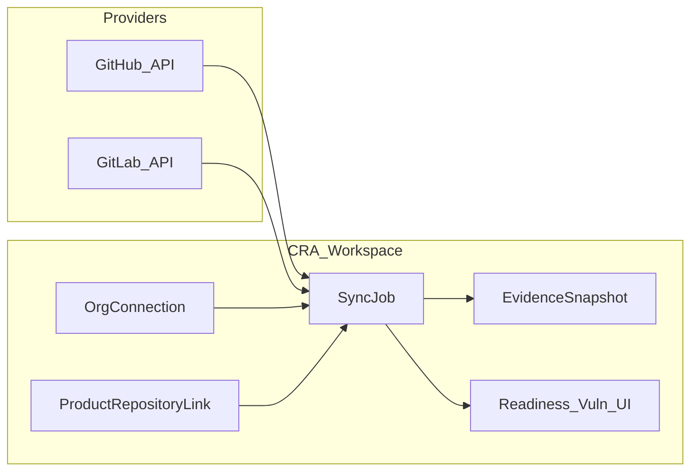

# Phase 2.1 — GitHub/GitLab Integration

**Версия:** 1.0  
**Дата:** 20 юли 2026 г.  
**Статус:** Planning (стартира след MVP 0.1 exit)  
**Родителски документи:**

- [CRA_Compliance_Workspace_Nachalen_Plan.md](CRA_Compliance_Workspace_Nachalen_Plan.md) (§14 Втора фаза)
- [MVP_Release_Closeout.md](MVP_Release_Closeout.md)

> **Ограничение от MVP (§11):** пълна двупосочна GitHub синхронизация **не** влиза в първата версия. Phase 2.1 е **еднопосочен** import/sync (provider → CRA Workspace).

---

## 1. Цел

Свързване на продукт/версия с GitHub или GitLab хранилище, така че:

- release evidence да се попълва от реални tags/releases;
- CI статус и Dependabot/security alerts да информират readiness и vulnerability triage;
- snapshots от provider данни да се запазват като одитируеми evidence записи.

---

## 2. Scope (in)

| Възможност                     | Описание                                                                             |
| ------------------------------ | ------------------------------------------------------------------------------------ |
| Repository link                | Обвързване на `Product` (и опционално `ProductVersion`) с remote repo URL + provider |
| OAuth / PAT                    | Org-level credentials (GitHub App или PAT; GitLab PAT/OAuth) — encrypted at rest     |
| Tags / Releases import         | Списък и детайли; map към product versions / release evidence                        |
| Pull requests (read)           | Обобщение за release window (merged PRs) — read-only                                 |
| CI status                      | Последен status на default branch / release tag (GitHub Actions / GitLab CI)         |
| Dependabot / dependency alerts | Import като кандидати или линкове към vulnerability workflow                         |
| Evidence snapshots             | Immutable snapshot (JSON + hash) в Evidence repository                               |

## 3. Scope (out) — изрично

- Двупосочен sync (CRA → GitHub issues/PRs/releases create/update)
- Автоматично отваряне на PRs / commit на файлове в repo
- Пълен clone на source code в workspace
- Real-time webhooks като единствен MVP на 2.1 (може P1 след polling)
- Customer deployments (§14 следващ модул)
- AI summarisation на PRs (§14 AI)

---

## 4. Предложена архитектура



### Данни (ориентировъчно)

- `organization_vcs_connections` — provider, auth type, encrypted token/app install id, status
- `product_repositories` — product_id, connection_id, remote_url, default_branch, external_id
- `vcs_sync_runs` — started_at, finished_at, status, summary JSON
- reuse `evidence` за snapshots (`type = integration_snapshot` или подобен)

### Права

- `organization_owner` / roles с products.manage: свързване на repo
- platform_admin: debug/audit на connections
- secrets никога в audit details (вече sensitive keys pattern)

---

## 5. MVP slice за 2.1 (първа итерация)

**Must**

1. Org connection (GitHub **или** GitLab — започни с единия provider, после втория).
2. Link product → repository.
3. Manual „Sync now“: tags/releases + CI status на default branch.
4. Evidence snapshot от последния успешен sync.
5. Audit events: connection created, sync succeeded/failed.
6. Feature tests с HTTP fakes.

**Should**

7. Import Dependabot / vulnerability alerts като draft vulnerability suggestions (не auto-create без review).
8. Map GitHub/GitLab release → `ProductVersion` suggestion.

**Could**

9. Scheduled sync (hourly/daily).
10. Webhooks за incremental updates.
11. Втори provider след като първият е стабилен.

---

## 6. UX повърхности

- Settings / Organization: „Integrations“ — connect GitHub/GitLab
- Product Edit / Manage: „Repository“ — link + Sync now + last sync status
- Evidence index: snapshot records
- Readiness: optional gap „No repository linked“ / „CI failing on release tag“

UI: shadcn-vue, Switch за enable sync, Lucide икони (`Github`, `Gitlab`, `RefreshCw`).

---

## 7. Рискове и mitigations

| Риск                            | Mitigation                      |
| ------------------------------- | ------------------------------- |
| Token leak                      | encrypt + never log; rotate UI  |
| Rate limits                     | backoff, sync run status        |
| Scope creep към двупосочен sync | фиксиран out-of-scope списък    |
| Provider API drift              | adapter interface `VcsProvider` |

---

## 8. Acceptance criteria (Phase 2.1 done)

1. Owner може да свърже org към GitHub **или** GitLab с валиден credential.
2. Owner свързва продукт към repo и пуска sync.
3. Tags/releases и CI status се виждат в UI.
4. Snapshot е в Evidence с hash.
5. Sync failure е видим и аудитиран.
6. Няма write операции към remote git hosting.

---

## 9. Зависимости и ред

```text
MVP 0.1 exit (MVP_Release_Closeout)
    ↓
Phase 2.1 GitHub/GitLab (този документ)
    ↓
Phase 2.2 Customer deployments
    ↓
AI / Policy library / Auditor portal
```

---

## 10. История

| Версия | Дата       | Промяна                                        |
| ------ | ---------- | ---------------------------------------------- |
| 1.0    | 2026-07-20 | Първоначален Phase 2.1 план (еднопосочен sync) |
