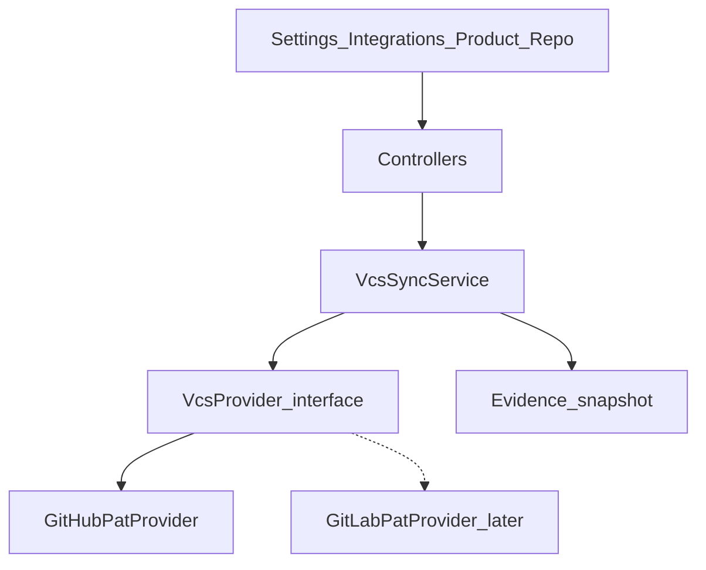

# Phase 2.1 — GitHub/GitLab Integration

**Версия:** 1.2  
**Дата:** 20 юли 2026 г.  
**Статус:** Active — Must complete (GitHub PAT); Should/Could pending  
**Родителски документи:**

- [CRA_Compliance_Workspace_Nachalen_Plan.md](CRA_Compliance_Workspace_Nachalen_Plan.md) (§14 Втора фаза)
- [MVP_Release_Closeout.md](MVP_Release_Closeout.md) (Closed — MVP 0.1 exited)

> **Ограничение от MVP (§11):** пълна двупосочна GitHub синхронизация **не** влиза в първата версия. Phase 2.1 е **еднопосочен** import/sync (provider → CRA Workspace).

> **Решение за първи slice:** **GitHub + PAT** (encrypted at rest). GitLab PAT и GitHub App остават следващи slices след стабилен sync.

---

## 1. Цел

Свързване на продукт/версия с GitHub или GitLab хранилище, така че:

- release evidence да се попълва от реални tags/releases;
- CI статус и Dependabot/security alerts да информират readiness и vulnerability triage;
- snapshots от provider данни да се запазват като одитируеми evidence записи.

---

## 2. Scope (in)

| Възможност                     | Описание                                                                             |
| ------------------------------ | ------------------------------------------------------------------------------------ |
| Repository link                | Обвързване на `Product` (и опционално `ProductVersion`) с remote repo URL + provider |
| OAuth / PAT                    | Org-level credentials — **първо GitHub PAT**; GitLab PAT/OAuth и GitHub App по-късно |
| Tags / Releases import         | Списък и детайли; map към product versions / release evidence                        |
| Pull requests (read)           | Обобщение за release window (merged PRs) — read-only                                 |
| CI status                      | Последен status на default branch / release tag (GitHub Actions / GitLab CI)         |
| Dependabot / dependency alerts | Import като кандидати или линкове към vulnerability workflow (Should)                |
| Evidence snapshots             | Immutable snapshot (JSON + hash) в Evidence repository                               |

## 3. Scope (out) — изрично

- Двупосочен sync (CRA → GitHub issues/PRs/releases create/update)
- Автоматично отваряне на PRs / commit на файлове в repo
- Пълен clone на source code в workspace
- Real-time webhooks като единствен MVP на 2.1 (може Could след polling)
- Customer deployments (§14 / Phase 2.2)
- AI summarisation на PRs (§14 AI)

---

## 4. Архитектура



### Provider interface

`App\Contracts\VcsProvider` (или `App\Services\Vcs\VcsProvider`):

- `listTags(ProductRepository $repo): array`
- `listReleases(ProductRepository $repo): array`
- `defaultBranchCiStatus(ProductRepository $repo): array`
- по-късно: `dependencyAlerts(ProductRepository $repo): array`

Първа имплементация: **`GitHubPatProvider`** (Laravel HTTP client). Тестове с `Http::fake()`.

Job: `SyncProductRepositoryJob` — за „Sync now“ и подготовка за scheduled sync.

### Права

- Connect / disconnect / link / sync: `products.manage` или org owner (същият pattern като product manage).
- `platform_admin`: вижда audit; няма нужда от отделен debug UI в първия slice.
- Токени: Laravel `encrypted` cast; никога в audit `details` (вече `AuditLogger::SENSITIVE_KEYS` покрива `token` / `secret`).

---

## 5. Данни (конкретна схема)

### `organization_vcs_connections`

| Колона           | Тип                   | Бележки                            |
| ---------------- | --------------------- | ---------------------------------- |
| id               | bigint PK             |                                    |
| organization_id  | FK                    | tenant                             |
| provider         | string                | `github` \| `gitlab`               |
| auth_type        | string                | първо само `pat`                   |
| token            | text (encrypted cast) | PAT                                |
| label            | string nullable       | потребителски етикет               |
| status           | string                | `active` \| `invalid` \| `revoked` |
| last_verified_at | timestamp nullable    |                                    |
| timestamps       |                       |                                    |

Unique: `(organization_id, provider)` за първия slice (една GitHub връзка на org).

### `product_repositories`

| Колона            | Тип                | Бележки                                  |
| ----------------- | ------------------ | ---------------------------------------- |
| id                | bigint PK          |                                          |
| product_id        | FK                 |                                          |
| connection_id     | FK                 | → organization_vcs_connections           |
| external_id       | string nullable    | GitHub `node_id` / numeric id            |
| full_name         | string             | `owner/repo`                             |
| remote_url        | string             | HTML или clone URL                       |
| default_branch    | string nullable    | от API                                   |
| last_synced_at    | timestamp nullable |                                          |
| last_sync_summary | json nullable      | tags count, CI conclusion, error message |
| timestamps        |                    |                                          |

Unique: `(product_id)` — един primary repo на продукт в първия slice.

### `vcs_sync_runs`

| Колона        | Тип                | Бележки                                           |
| ------------- | ------------------ | ------------------------------------------------- |
| id            | bigint PK          |                                                   |
| repository_id | FK                 | → product_repositories                            |
| status        | string             | `pending` \| `running` \| `succeeded` \| `failed` |
| triggered_by  | FK users nullable  |                                                   |
| started_at    | timestamp nullable |                                                   |
| finished_at   | timestamp nullable |                                                   |
| summary       | json nullable      | counts, CI status, error                          |
| timestamps    |                    |                                                   |

### Разширения в съществуващ код

- [`app/Enums/EvidenceType.php`](../app/Enums/EvidenceType.php) — добави `integration_snapshot`
- [`app/Enums/AuditEventType.php`](../app/Enums/AuditEventType.php) — напр. `vcs_connection_created`, `vcs_connection_deleted`, `vcs_sync_succeeded`, `vcs_sync_failed`
- i18n: `lang/en.json`, `lang/bg.json` (evidence types, audit events, settings/integrations, readiness gaps)

---

## 6. UX / routes

### Settings — Integrations

- Нов nav item в [`resources/js/layouts/settings/Layout.vue`](../resources/js/layouts/settings/Layout.vue)
- Страница: `resources/js/pages/settings/Integrations.vue`
- Routes в [`routes/settings.php`](../routes/settings.php):
    - `GET settings/integrations` → show
    - `POST settings/integrations/github` → store PAT
    - `DELETE settings/integrations/{connection}` → disconnect
- Controller: `App\Http\Controllers\Settings\IntegrationController`
- UI: shadcn Input/Button; Lucide `Github`, `Trash2`; без raw checkbox

### Product — Repository

- Секция на Product Edit или отделен manage panel: link repo (`owner/repo` или URL) + Sync now + last sync status
- Routes (org-scoped през `currentOrganization()`, nested under products):
    - `POST/PUT/DELETE products/{product}/repository`
    - `POST products/{product}/repository/sync`
- Икони: `Github`, `RefreshCw`, `Save`

### Evidence / Readiness

- Evidence index показва type `integration_snapshot`
- [`ProductReadinessService`](../app/Services/ProductReadinessService.php): gaps `no_repository_linked`, `ci_failing` (warn/fail)

---

## 7. Имплементационен ред (slices)

### Must (първа итерация)

1. Migrations + Eloquent models + encrypted token cast — **Done** (2026-07-20)
2. GitHub PAT connection UI (settings) + audit events — **Done** (2026-07-20)
3. Product ↔ repository link — **Done** (2026-07-20)
4. Sync now: tags/releases + CI status + `vcs_sync_runs` — **Done** (2026-07-20)
5. Evidence snapshot (JSON + hash) при успешен sync — **Done** (2026-07-20)
6. Readiness gaps + i18n EN/BG — **Done** (2026-07-20)
7. Feature tests с `Http::fake()` — **Done** (2026-07-20)

### Should

8. Import Dependabot / vulnerability alerts като draft suggestions (не auto-create без review)
9. Map GitHub release → `ProductVersion` suggestion

### Could

10. Scheduled sync (hourly/daily)
11. Webhooks за incremental updates
12. GitLab PAT provider (втори adapter)
13. GitHub App вместо/до PAT

---

## 8. MVP slice за 2.1 (резюме)

**Must** — точки 1–7 по-горе (само GitHub PAT).

**Should** — Dependabot suggestions; release → version suggestion.

**Could** — schedule, webhooks, GitLab, GitHub App.

---

## 9. Рискове и mitigations

| Риск                            | Mitigation                      |
| ------------------------------- | ------------------------------- |
| Token leak                      | encrypt + never log; rotate UI  |
| Rate limits                     | backoff, sync run status        |
| Scope creep към двупосочен sync | фиксиран out-of-scope списък    |
| Provider API drift              | adapter interface `VcsProvider` |

---

## 10. Acceptance criteria (Phase 2.1 done)

1. Owner може да свърже org към **GitHub** с валиден PAT (GitLab — следващ provider slice).
2. Owner свързва продукт към repo и пуска sync.
3. Tags/releases и CI status се виждат в UI.
4. Snapshot е в Evidence с hash (`integration_snapshot`).
5. Sync failure е видим и аудитиран.
6. Няма write операции към remote git hosting.

---

## 11. Зависимости и ред

```text
MVP 0.1 exit (MVP_Release_Closeout) — Done 2026-07-20
    ↓
Phase 2.1 GitHub/GitLab (този документ) — Active
    ↓
Phase 2.2 Customer deployments
    ↓
AI / Policy library / Auditor portal
```

---

## 12. История

| Версия | Дата       | Промяна                                                                 |
| ------ | ---------- | ----------------------------------------------------------------------- |
| 1.2    | 2026-07-20 | Must slices 1–7 Done (GitHub PAT sync + evidence + readiness + tests)   |
| 1.1    | 2026-07-20 | Active / implementation-ready: GitHub PAT first, schema, routes, slices |
| 1.0    | 2026-07-20 | Първоначален Phase 2.1 план (еднопосочен sync)                          |
