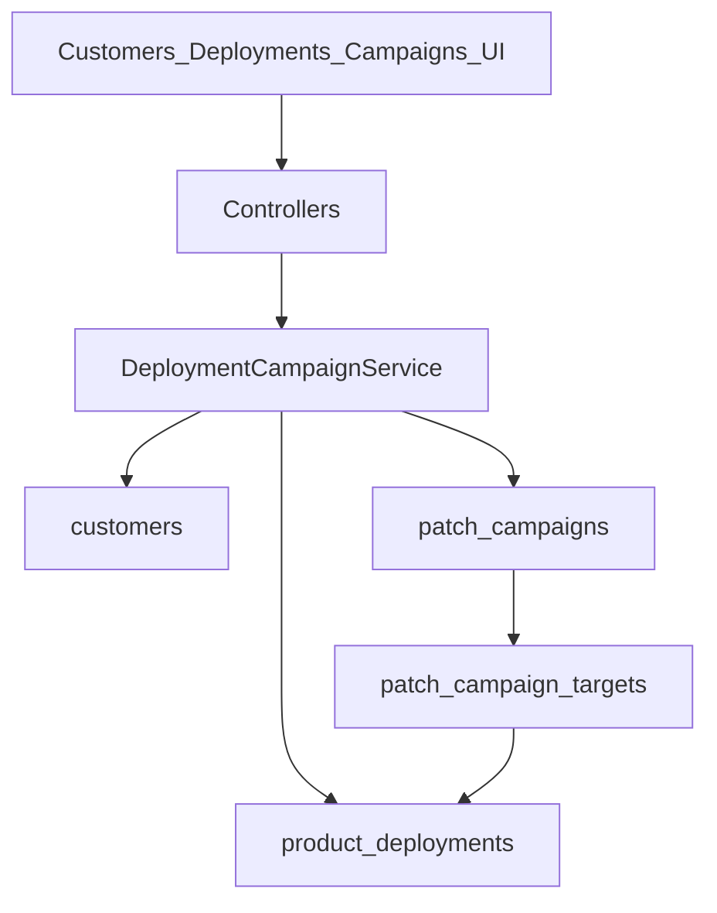

# Phase 2.2 — Customer Deployments

**Версия:** 1.10  
**Дата:** 21 юли 2026 г.  
**Статус:** Active — Must complete; Should 8–9 Done; Should 10–11 / Could pending  
**Родителски документи:**

- [CRA_Compliance_Workspace_Nachalen_Plan.md](CRA_Compliance_Workspace_Nachalen_Plan.md) (§14 Customer deployments, §5.15)
- [Phase2_1_GitHub_GitLab_Integration.md](Phase2_1_GitHub_GitLab_Integration.md) (Closed — VCS sync Done)
- [MVP_Release_Closeout.md](MVP_Release_Closeout.md) (Closed — MVP 0.1 exited)

> **Цел на фазата:** org-level регистър на клиенти и customer deployments (инсталации), плюс patch campaigns с ръчно потвърждение на update — без външен email/SMS provider в Must.

> **Naming:** `products.deployment_model` (свободен текст на продукта) ≠ `product_deployments` (customer installations). В UI/i18n: „Deployment model“ vs „Customer deployments“ / „Installations“.

---

## 1. Цел

Да може производителят да:

- държи списък със засегнати клиенти / инсталации на продукт;
- при vulnerability или corrective release да стартира **patch campaign**;
- следи кой е уведомен, кой е потвърдил update, кой остава exposed;
- свърже rollout статуса с `ProductVersion` и audit trail (и по желание evidence).

---

## 2. Scope (in)

| Възможност              | Описание                                                                                       |
| ----------------------- | ---------------------------------------------------------------------------------------------- |
| Customer register       | Org-scoped клиенти (име, contacts, criticality)                                                |
| Deployment register     | Инсталация: customer × product × version × environment                                         |
| Patch campaign          | Кампания към product version (или vulnerability) с целеви deployments                          |
| Notification log fields | `notified_at` + `notification_note` на target (без отделна event таблица в Must; без SMTP/SMS) |
| Update confirmation     | Ръчен статус: pending / notified / acknowledged / updated / excepted                           |
| Affected-customer list  | Филтър/export на deployments по продукт/версия при кампания                                    |
| Audit                   | Create/update campaign + confirmation events                                                   |

## 3. Scope (out) — изрично

- Автоматичен email/SMS/webhook към клиенти (Could по-късно)
- Customer self-service portal / magic-link confirmation
- Inventory sync от MDM / cloud accounts
- Автоматично „unsupported deployments remain“ email от support periods (вече има dashboard buckets; не дублираме тук)
- Append-only multi-event notification history table (Should/Could, ако трябват много събития на target)
- AI draft на customer communications (§14 AI)
- Auditor portal package (§14)
- `support_contract` поле (§5.15) — отложено; не е Must

---

## 4. Архитектура



### Права

- Manage: `products.manage` (или org owner) — същият pattern като product versions.
- View: `products.view` — viewer вижда customers/deployments/campaigns, без create/update/delete.
- `platform_admin`: audit visibility; без отделен debug UI в Must.
- Отделни `customers.*` permission slugs — не в Must (може по-късно).

### UI conventions

- Index tables: server-side `DataTable` + `useApiTable` + `internal-api` (mirror: controls / product vulnerabilities).
- Boolean flags: `Switch` (shadcn).
- Icons: `Plus` create, `Save` update, `Pencil` edit, `Trash2` delete, `ArrowLeft` back, `Users` customers.

### Navigation (фиксирано)

| Модул           | Къде                                                                      |
| --------------- | ------------------------------------------------------------------------- |
| Customers       | Top-level sidebar item (като Controls), org-scoped `/customers`           |
| Deployments     | Product module (`productModules` + `GET /products/{product}/deployments`) |
| Patch campaigns | Product module (`GET /products/{product}/campaigns`)                      |

---

## 5. Данни (чернова схема)

### `customers`

| Колона          | Тип             | Бележки                         |
| --------------- | --------------- | ------------------------------- |
| id              | bigint PK       |                                 |
| organization_id | FK              | tenant                          |
| name            | string          |                                 |
| external_ref    | string nullable | CRM / contract id               |
| primary_contact | string nullable | име / email (plain text в Must) |
| criticality     | string          | `low` \| `medium` \| `high`     |
| notes           | text nullable   |                                 |
| is_active       | boolean         | default true                    |
| timestamps      |                 |                                 |

Index: `(organization_id, name)`.

### `product_deployments`

| Колона                   | Тип                | Бележки                              |
| ------------------------ | ------------------ | ------------------------------------ |
| id                       | bigint PK          |                                      |
| organization_id          | FK                 | denormalized tenant                  |
| customer_id              | FK                 | → customers                          |
| product_id               | FK                 | → products                           |
| product_version_id       | FK nullable        | текущо потвърдена версия             |
| environment              | string             | `production` \| `staging` \| `other` |
| installation_date        | date nullable      |                                      |
| internet_exposure        | boolean            | default false                        |
| update_channel           | string nullable    | free text / enum later               |
| last_confirmed_at        | timestamp nullable |                                      |
| custom_modifications     | boolean            | default false                        |
| end_of_support_exception | boolean            | default false                        |
| notes                    | text nullable      |                                      |
| timestamps               |                    |                                      |

Unique (Must): `(customer_id, product_id, environment)` — една deployment линия на env.  
(По-късно: ако трябват 2+ prod инсталации на същия клиент → `label`/`site`; не в Must.)

### `patch_campaigns`

| Колона                   | Тип                | Бележки                                                |
| ------------------------ | ------------------ | ------------------------------------------------------ |
| id                       | bigint PK          |                                                        |
| organization_id          | FK                 |                                                        |
| product_id               | FK                 |                                                        |
| target_version_id        | FK                 | целева `product_versions.id`                           |
| product_vulnerability_id | FK nullable        | → `product_vulnerabilities.id` (не `vulnerability_id`) |
| title                    | string             |                                                        |
| status                   | string             | `draft` \| `active` \| `completed` \| `cancelled`      |
| started_at               | timestamp nullable |                                                        |
| completed_at             | timestamp nullable |                                                        |
| notes                    | text nullable      |                                                        |
| created_by               | FK users nullable  |                                                        |
| timestamps               |                    |                                                        |

### `patch_campaign_targets`

| Колона            | Тип                | Бележки                                                              |
| ----------------- | ------------------ | -------------------------------------------------------------------- |
| id                | bigint PK          |                                                                      |
| campaign_id       | FK                 | → patch_campaigns                                                    |
| deployment_id     | FK                 | → product_deployments                                                |
| status            | string             | `pending` \| `notified` \| `acknowledged` \| `updated` \| `excepted` |
| notified_at       | timestamp nullable | при преход към `notified`                                            |
| acknowledged_at   | timestamp nullable | при преход към `acknowledged`                                        |
| confirmed_at      | timestamp nullable | при преход към `updated` (или `excepted`, ако е приложимо)           |
| notification_note | text nullable      | „изпратен email на …“ / ticket ref                                   |
| timestamps        |                    | стандартни `created_at` / `updated_at`                               |

Unique: `(campaign_id, deployment_id)`.

### Правила при campaign / status

**Auto-seed targets** (при activate от draft): всички `product_deployments` за `product_id`, където `product_version_id` е `null` **или** ≠ `target_version_id`. Не seed-ваме deployments, които вече са на target версията.

**При target → `updated`:** освен status timestamps, update-ни `product_deployments.product_version_id` = campaign `target_version_id` и `last_confirmed_at` = now. Така регистърът не остава остарял.

**При `excepted`:** не пипай deployment version; само target status + `confirmed_at` / note.

**Campaign completion (Should):** когато всички targets са `updated` \| `excepted` (или няма targets след activate), кампанията → `completed` + `completed_at`.

### Разширения

- [`app/Enums/AuditEventType.php`](../app/Enums/AuditEventType.php) — `customer_*`, `deployment_*`, `patch_campaign_*`, `campaign_target_updated`
- i18n EN/BG: customers, customer deployments/installations, campaigns, statuses, readiness gaps
- Readiness (Should): gap `unresolved_exposed_deployments` когато има active campaign с non-updated high-criticality targets

---

## 6. UX / routes

### Customers (org)

- Sidebar top-level + `GET /customers` — DataTable index
- `GET/POST /customers/create`, `GET/PUT/DELETE /customers/{customer}`
- Internal API: `GET /internal-api/customers` (mirror controls)

### Deployments (product-scoped)

- Product module: `GET /products/{product}/deployments` (+ create/edit)
- Link customer + version + environment; edit confirmation fields
- Internal API: `GET /internal-api/products/{product}/deployments`

### Patch campaigns (product-scoped)

- `GET /products/{product}/campaigns` — index
- Create: select target version (+ optional `product_vulnerability_id`), seed targets per правилото в §5
- Campaign detail: targets table + status actions (notified / acknowledged / updated / excepted)
- Export: `GET /products/{product}/campaigns/{campaign}/export` — XLSX of affected installations
- Internal API: `GET /internal-api/products/{product}/campaigns` (+ targets nested или separate)

---

## 7. Имплементационен ред (slices)

### Must

1. Migrations + models + enums (customer criticality, deployment env, campaign/target status) — **Done** (2026-07-21)
2. Customer CRUD (Inertia + server-side DataTable API) + audit — **Done** (2026-07-21)
3. Product deployments CRUD (link customer/version/env) + audit — **Done** (2026-07-21)
4. Patch campaign create (draft → active) + auto-attach matching deployments (§5 правило) — **Done** (2026-07-21)
5. Target status updates (note + timestamps; при `updated` sync deployment version) + audit — **Done** (2026-07-21)
6. Feature tests (Pest) за CRUD + campaign flow + view-only forbidden manage — **Done** (2026-07-21)
7. i18n EN/BG (вкл. разграничение deployment model vs customer deployments) — **Done** (2026-07-21)

### Should

8. Campaign completion when all targets `updated` \| `excepted` — **Done** (2026-07-21)
9. Affected-customer export (XLSX) от campaign — **Done** (2026-07-21)
10. Readiness gap за unresolved exposed deployments (active campaign)
11. Optional link campaign ↔ vulnerability на Product Vulnerability show

### Could

12. Email notification stub (Mailables + queued job; provider config later)
13. Bulk import customers/deployments (CSV)
14. Support-period cross-check: list deployments on unsupported versions
15. Append-only notification event log per target (ако Must полетата не стигат)

---

## 8. MVP slice за 2.2 (резюме)

**Must** — customers + deployments + manual patch campaign tracking (без outbound messaging).

**Should** — campaign completion rules, XLSX export, readiness gap, vulnerability link.

**Could** — email stub, CSV import, EOS cross-check, multi-event notification log.

---

## 9. Рискове и mitigations

| Риск                                     | Mitigation                                                  |
| ---------------------------------------- | ----------------------------------------------------------- |
| PII в contacts                           | org-scoped; minimize fields; audit без secrets              |
| Scope creep към customer portal          | fixed out-of-scope                                          |
| Дублиране на „notification“ с reporting  | campaigns ≠ CRA regulator reporting workflow                |
| Големи org списъци                       | server-side DataTable only                                  |
| Объркване с `products.deployment_model`  | ясни i18n labels („Customer deployments“ / „Installations“) |
| Остарял deployment version след campaign | при target `updated` sync `product_version_id`              |

---

## 10. Acceptance criteria (Phase 2.2 done)

1. Owner създава customer и deployment за продукт/версия.
2. Owner стартира patch campaign към target version и вижда целеви deployments (seed по §5 правило).
3. Owner маркира target като notified / updated с бележка; при `updated` deployment version = target version.
4. Viewer (`products.view` без manage) вижда списъците, но не може да създава/променя.
5. Промените са в audit log.
6. Няма задължителен външен messaging provider за Must.

---

## 11. Зависимости и ред

```text
Phase 2.1 GitHub/GitLab — Closed 2026-07-21
    ↓
Phase 2.2 Customer deployments (този документ) — Active
    ↓
AI / Policy library / Auditor portal
```

---

## 12. История

| Версия | Дата       | Промяна                                                                                                                                                     |
| ------ | ---------- | ----------------------------------------------------------------------------------------------------------------------------------------------------------- |
| 1.10   | 2026-07-21 | Should 9 Done: affected-customer XLSX export от campaign (първоначално CSV; сменено на XLSX)                                                                |
| 1.9    | 2026-07-21 | Should 8 Done: auto-complete campaign when all targets updated/excepted (incl. empty seed)                                                                  |
| 1.8    | 2026-07-21 | Must 7 Done: i18n EN/BG + ясно разграничение delivery model vs customer installations; Must slice complete                                                  |
| 1.7    | 2026-07-21 | Must 6 Done: E2E campaign flow + view-only forbidden manage tests                                                                                           |
| 1.6    | 2026-07-21 | Must 5 Done: target status updates + deployment version sync + audit                                                                                        |
| 1.5    | 2026-07-21 | Must 4 Done: Patch campaign create/activate + auto-seed targets                                                                                             |
| 1.4    | 2026-07-21 | Must 3 Done: Product deployments CRUD (DataTable + audit)                                                                                                   |
| 1.3    | 2026-07-21 | Must 2 Done: Customer CRUD (DataTable + audit)                                                                                                              |
| 1.2    | 2026-07-21 | Must 1 Done: migrations + models + enums                                                                                                                    |
| 1.1    | 2026-07-21 | Review fixes: `product_vulnerability_id`; махнат `updated_at_status`; nav фиксиран; seed + version-sync правила; AC за viewer; naming vs `deployment_model` |
| 1.0    | 2026-07-21 | Първоначален план (Must = manual campaigns)                                                                                                                 |
