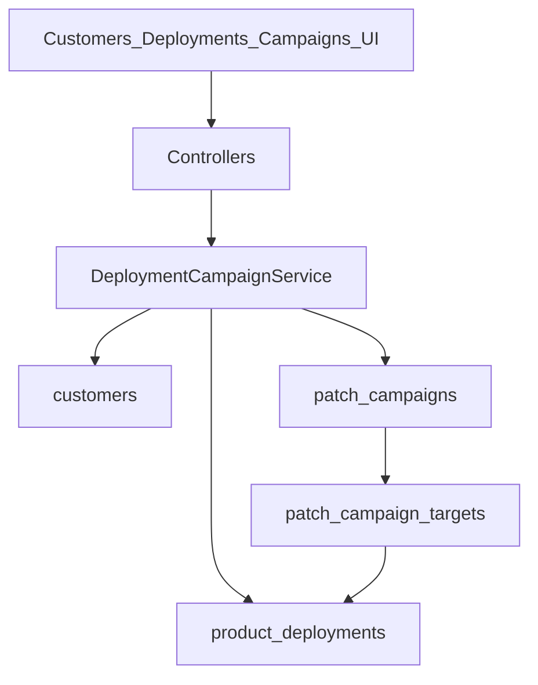

# Phase 2.2 — Customer Deployments

**Версия:** 1.0  
**Дата:** 21 юли 2026 г.  
**Статус:** Active — implementation-ready (plan for review)  
**Родителски документи:**

- [CRA_Compliance_Workspace_Nachalen_Plan.md](CRA_Compliance_Workspace_Nachalen_Plan.md) (§14 Customer deployments, §5.15)
- [Phase2_1_GitHub_GitLab_Integration.md](Phase2_1_GitHub_GitLab_Integration.md) (Closed — VCS sync Done)
- [MVP_Release_Closeout.md](MVP_Release_Closeout.md) (Closed — MVP 0.1 exited)

> **Цел на фазата:** org-level регистър на клиенти и deployments, плюс patch campaigns с ръчно потвърждение на update — без външен email/SMS provider в Must.

---

## 1. Цел

Да може производителят да:

- държи списък със засегнати клиенти / инсталации на продукт;
- при vulnerability или corrective release да стартира **patch campaign**;
- следи кой е уведомен, кой е потвърдил update, кой остава exposed;
- свърже rollout статуса с `ProductVersion` и audit trail (и по желание evidence).

---

## 2. Scope (in)

| Възможност              | Описание                                                                 |
| ----------------------- | ------------------------------------------------------------------------ |
| Customer register       | Org-scoped клиенти (име, contacts, criticality)                          |
| Deployment register     | Инсталация: customer × product × version × environment                   |
| Patch campaign          | Кампания към product version (или vulnerability) с целеви deployments    |
| Notification history    | Записи „уведомен“ (manual log; без SMTP/SMS в Must)                      |
| Update confirmation     | Ръчен статус: pending / notified / acknowledged / updated / excepted     |
| Affected-customer list  | Филтър/export на deployments по продукт/версия при кампания              |
| Audit                   | Create/update campaign + confirmation events                             |

## 3. Scope (out) — изрично

- Автоматичен email/SMS/webhook към клиенти (Could по-късно)
- Customer self-service portal / magic-link confirmation
- Inventory sync от MDM / cloud accounts
- Автоматично „unsupported deployments remain“ email от support periods (вече има dashboard buckets; не дублираме тук)
- AI draft на customer communications (§14 AI)
- Auditor portal package (§14)

---

## 4. Архитектура



### Права

- Manage: `products.manage` (или org owner) — същият pattern като product manage.
- View: `products.view`.
- `platform_admin`: audit visibility; без отделен debug UI в Must.

### UI conventions

- Index tables: server-side `DataTable` + `useApiTable` + `internal-api` (като organizations).
- Boolean flags: `Switch` (shadcn).
- Icons: `Plus` create, `Save` update, `Pencil` edit, `Trash2` delete, `ArrowLeft` back, `Users` customers.

---

## 5. Данни (чернова схема)

### `customers`

| Колона          | Тип                   | Бележки                            |
| --------------- | --------------------- | ---------------------------------- |
| id              | bigint PK             |                                    |
| organization_id | FK                    | tenant                             |
| name            | string                |                                    |
| external_ref    | string nullable       | CRM / contract id                  |
| primary_contact | string nullable       | име / email (plain text в Must)    |
| criticality     | string                | `low` \| `medium` \| `high`        |
| notes           | text nullable         |                                    |
| is_active       | boolean               | default true                       |
| timestamps      |                       |                                    |

Index: `(organization_id, name)`.

### `product_deployments`

| Колона                 | Тип                | Бележки                                      |
| ---------------------- | ------------------ | -------------------------------------------- |
| id                     | bigint PK          |                                              |
| organization_id        | FK                 | denormalized tenant                          |
| customer_id            | FK                 | → customers                                  |
| product_id             | FK                 | → products                                   |
| product_version_id     | FK nullable        | текущо потвърдена версия                     |
| environment            | string             | `production` \| `staging` \| `other`         |
| installation_date      | date nullable      |                                              |
| internet_exposure      | boolean            | default false                                |
| update_channel         | string nullable    | free text / enum later                       |
| last_confirmed_at      | timestamp nullable |                                              |
| custom_modifications   | boolean            | default false                                |
| end_of_support_exception | boolean          | default false                                |
| notes                  | text nullable      |                                              |
| timestamps             |                    |                                              |

Unique (Must): `(customer_id, product_id, environment)` — една deployment линия на env.

### `patch_campaigns`

| Колона              | Тип                | Бележки                                           |
| ------------------- | ------------------ | ------------------------------------------------- |
| id                  | bigint PK          |                                                   |
| organization_id     | FK                 |                                                   |
| product_id          | FK                 |                                                   |
| target_version_id   | FK                 | целева `product_versions.id`                      |
| vulnerability_id    | FK nullable        | опционална връзка към `product_vulnerabilities`   |
| title               | string             |                                                   |
| status              | string             | `draft` \| `active` \| `completed` \| `cancelled` |
| started_at          | timestamp nullable |                                                   |
| completed_at        | timestamp nullable |                                                   |
| notes               | text nullable      |                                                   |
| created_by          | FK users nullable  |                                                   |
| timestamps          |                    |                                                   |

### `patch_campaign_targets`

| Колона              | Тип                | Бележки                                                                 |
| ------------------- | ------------------ | ----------------------------------------------------------------------- |
| id                  | bigint PK          |                                                                         |
| campaign_id         | FK                 | → patch_campaigns                                                       |
| deployment_id       | FK                 | → product_deployments                                                   |
| status              | string             | `pending` \| `notified` \| `acknowledged` \| `updated` \| `excepted`    |
| notified_at         | timestamp nullable | manual                                                                  |
| acknowledged_at     | timestamp nullable |                                                                         |
| updated_at_status   | timestamp nullable | кога е маркиран `updated` (или ползвай `confirmed_at`)                  |
| confirmed_at        | timestamp nullable |                                                                         |
| notification_note   | text nullable      | „изпратен email на …“ / ticket ref                                      |
| timestamps          |                    |                                                                         |

Unique: `(campaign_id, deployment_id)`.

### Разширения

- [`app/Enums/AuditEventType.php`](../app/Enums/AuditEventType.php) — `customer_*`, `deployment_*`, `patch_campaign_*`, `campaign_target_updated`
- i18n EN/BG: customers, deployments, campaigns, statuses, readiness gaps (опционално)
- Readiness (Should): gap `unresolved_exposed_deployments` когато има active campaign с non-updated high-criticality targets

---

## 6. UX / routes

### Customers (org)

- Nav: под Products или Settings-adjacent — **Products area** preferred (`/customers` org-scoped)
- `GET /customers` — DataTable index
- `GET/POST /customers/create`, `GET/PUT/DELETE /customers/{customer}`
- Internal API: `GET /internal-api/customers`

### Deployments (product-scoped + optional org list)

- Секция на Product Edit **или** `GET /products/{product}/deployments`
- Link customer + version + environment; edit confirmation fields
- Internal API: `GET /internal-api/products/{product}/deployments`

### Patch campaigns

- `GET /products/{product}/campaigns` — index
- Create: select target version (+ optional vulnerability), auto-seed targets from deployments still on older versions (or all)
- Campaign detail: targets table + status actions (notified / acknowledged / updated / excepted)
- Internal API: `GET /internal-api/products/{product}/campaigns` (+ targets nested or separate)

---

## 7. Имплементационен ред (slices)

### Must

1. Migrations + models + enums (customer criticality, deployment env, campaign/target status)
2. Customer CRUD (Inertia + server-side DataTable API) + audit
3. Product deployments CRUD (link customer/version/env) + audit
4. Patch campaign create (draft → active) + auto-attach matching deployments
5. Target status updates (manual notification note + confirmation) + audit
6. Feature tests (Pest) за CRUD + campaign flow
7. i18n EN/BG

### Should

8. Campaign completion when all targets `updated` \| `excepted`
9. Affected-customer export (CSV) от campaign
10. Readiness gap за unresolved exposed deployments (active campaign)
11. Optional link campaign ↔ vulnerability на Product Vulnerability show

### Could

12. Email notification stub (Mailables + queued job; provider config later)
13. Bulk import customers/deployments (CSV)
14. Support-period cross-check: list deployments on unsupported versions

---

## 8. MVP slice за 2.2 (резюме)

**Must** — customers + deployments + manual patch campaign tracking (без outbound messaging).

**Should** — campaign completion rules, CSV export, readiness gap, vulnerability link.

**Could** — email stub, CSV import, EOS cross-check.

---

## 9. Рискове и mitigations

| Риск                                      | Mitigation                                      |
| ----------------------------------------- | ----------------------------------------------- |
| PII в contacts                            | org-scoped; minimize fields; audit без secrets  |
| Scope creep към customer portal           | fixed out-of-scope                              |
| Дублиране на „notification“ с reporting   | campaigns ≠ CRA regulator reporting workflow    |
| Големи org списъци                        | server-side DataTable only                      |

---

## 10. Acceptance criteria (Phase 2.2 done)

1. Owner създава customer и deployment за продукт/версия.
2. Owner стартира patch campaign към target version и вижда целеви deployments.
3. Owner маркира target като notified / updated с бележка; историята е видима.
4. Промените са в audit log.
5. Няма задължителен външен messaging provider за Must.

---

## 11. Зависимости и ред

```text
Phase 2.1 GitHub/GitLab — Closed 2026-07-21
    ↓
Phase 2.2 Customer deployments (този документ) — Active
    ↓
AI / Policy library / Auditor portal
```

---

## 12. История

| Версия | Дата       | Промяна                                      |
| ------ | ---------- | -------------------------------------------- |
| 1.0    | 2026-07-21 | Първоначален план (Must = manual campaigns)  |
