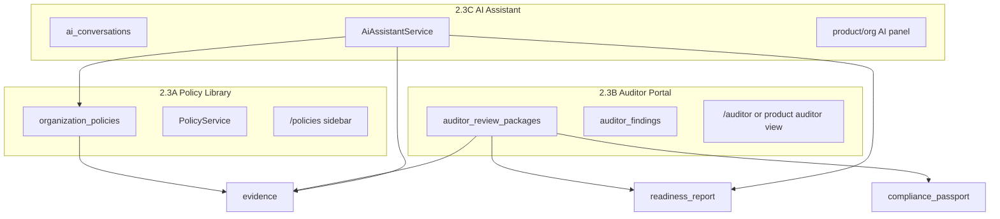

# Phase 2.3 — Policy Library, Auditor Portal & AI Assistant

**Версия:** 1.5  
**Дата:** 21 юли 2026 г.  
**Статус:** Active — 2.3A Must + Should 7–9 + Could 10 Done; 2.3B–C pending  
**Родителски документи:**

- [CRA_Compliance_Workspace_Nachalen_Plan.md](CRA_Compliance_Workspace_Nachalen_Plan.md) (§6 AI, §14 Втора фаза)
- [Phase2_2_Release_Closeout.md](Phase2_2_Release_Closeout.md) (Closed — Phase 2.2 exited)
- [Phase2_2_Customer_Deployments.md](Phase2_2_Customer_Deployments.md) (Closed)

> **Цел на вълната:** org-level **policy library**, **auditor-facing read-only portal** с evidence packages/findings, и **AI assistant** като помощник (не автономен compliance organ) — след затворен Phase 2.2.

> **Ред на имплементация (фиксиран):** **2.3A Policy library** → **2.3B Auditor portal** → **2.3C AI assistant**. Auditor portal и AI consume-ват структурирани policies и съществуващи passport/evidence/readiness артефакти.

---

## 1. Цел

Да може организацията да:

- държи одобрени организационни политики (CVD, SDL, support, update, incident response, third-party);
- споделя **read-only** compliance пакет с външен одитор/консултант (findings + comments + export);
- ползва AI за mapping/gap analysis/draft suggestions **с задължителен human review** (§6).

---

## 2. Scope (in) — по модул

### 2.3A Policy library

| Възможност        | Описание                                                        |
| ----------------- | --------------------------------------------------------------- |
| Policy register   | Org-scoped документи по тип (§14)                               |
| Lifecycle         | `draft` → `under_review` → `approved` → `retired`               |
| Versioning        | Нова версия supersede-ва предишна; history visible              |
| Starter templates | EN/BG markdown шаблони per policy type                          |
| Evidence link     | Optional: publish approved policy като Evidence (`type=policy`) |
| Readiness hint    | Gap когато липсват задължителни approved policies               |

**Policy types (enum):**

- `vulnerability_disclosure`
- `secure_development`
- `support`
- `update`
- `incident_response`
- `third_party_components`

### 2.3B Auditor portal

| Възможност      | Описание                                                             |
| --------------- | -------------------------------------------------------------------- |
| Auditor role UX | Dedicated read-only surfaces (роля `auditor` вече съществува в RBAC) |
| Review package  | Product-scoped snapshot: passport + readiness + selected evidence    |
| Findings        | Auditor comments с severity + remediation status                     |
| Export          | PDF/ZIP на package + findings log                                    |
| Access scope    | Org member с роля Auditor; без manage mutations                      |

### 2.3C AI assistant

| Възможност             | Описание                                                               |
| ---------------------- | ---------------------------------------------------------------------- |
| Regulatory assistant   | Q&A grounded in requirements, controls, evidence, policies, product    |
| Document analyser stub | Upload → suggested mappings/gaps (human review required)               |
| Draft generator stub   | Advisory / notification / risk text drafts (no auto-send / auto-close) |
| Audit                  | Prompt + response logged; no secrets in audit details                  |
| Provider config        | `CRA_AI_ENABLED` + provider credentials later (mirror email stub)      |

---

## 3. Scope (out) — изрично

- AI автономно определя CRA applicability, затваря vulns, submit-ва reports (§6)
- Notified-body portal / regulatory submission automation
- Full RAG vector DB / embedding pipeline в Must (може file-based context в Must)
- Real-time collaborative editing на policies (Google Docs style)
- Magic-link anonymous auditor access без org user (Could по-късно)
- Customer self-service portal (Phase 2.2 out-of-scope)
- Billing tier enforcement за auditor/AI features

---

## 4. Архитектура



### Права

| Модул          | Manage                          | View                                      |
| -------------- | ------------------------------- | ----------------------------------------- |
| Policies       | `organizations.manage` / owner  | `products.view` + org members             |
| Auditor portal | Owner creates package           | `auditor` role + assigned package viewers |
| Findings       | Auditor creates; owner responds | Package participants read-only            |
| AI assistant   | `products.manage` starts thread | Same org; viewer may ask read-only Q&A    |

### UI conventions

- Policy index: server-side `DataTable` + `useApiTable` (mirror controls/customers).
- Policy body: markdown textarea + preview (или rich text later — не в Must).
- Auditor portal: read-only reuse на passport/readiness components where possible.
- AI: side panel or dedicated page; shadcn `Dialog` / chat layout; disclaimer visible.

### Navigation (фиксирано)

| Модул          | Къде                                                     |
| -------------- | -------------------------------------------------------- |
| Policy library | Top-level sidebar `/policies` (като Controls, Customers) |
| Auditor portal | Top-level `/auditor` **или** org menu „Auditor reviews“  |
| AI assistant   | Product module + optional org dashboard entry            |

---

## 5. Данни (чернова схема)

### `organization_policies`

| Колона          | Тип            | Бележки                                              |
| --------------- | -------------- | ---------------------------------------------------- |
| id              | bigint PK      |                                                      |
| organization_id | FK             | tenant                                               |
| policy_type     | string         | enum §2.3A                                           |
| title           | string         |                                                      |
| status          | string         | `draft` \| `under_review` \| `approved` \| `retired` |
| version_label   | string         | e.g. `1.0`, `2026-07`                                |
| body            | longtext       | markdown                                             |
| supersedes_id   | FK nullable    | → organization_policies                              |
| approved_at     | timestamp null |                                                      |
| approved_by     | FK users null  |                                                      |
| evidence_id     | FK nullable    | → evidence when published                            |
| notes           | text nullable  | internal                                             |
| timestamps      |                |                                                      |

Index: `(organization_id, policy_type, status)`.

Unique active approved per type (application rule): max one `approved` per `(organization_id, policy_type)` unless superseded chain.

### `auditor_review_packages`

| Колона          | Тип            | Бележки                         |
| --------------- | -------------- | ------------------------------- |
| id              | bigint PK      |                                 |
| organization_id | FK             |                                 |
| product_id      | FK             |                                 |
| title           | string         | e.g. „CRA readiness review Q3“  |
| status          | string         | `draft` \| `shared` \| `closed` |
| shared_at       | timestamp null |                                 |
| closed_at       | timestamp null |                                 |
| created_by      | FK users       |                                 |
| notes           | text null      | scope for auditor               |
| timestamps      |                |                                 |

### `auditor_review_package_evidence` (pivot)

| Колона      | Тип |
| ----------- | --- |
| package_id  | FK  |
| evidence_id | FK  |

### `auditor_findings`

| Колона        | Тип            | Бележки                                            |
| ------------- | -------------- | -------------------------------------------------- |
| id            | bigint PK      |                                                    |
| package_id    | FK             |                                                    |
| severity      | string         | `info` \| `minor` \| `major` \| `critical`         |
| status        | string         | `open` \| `accepted` \| `remediated` \| `wont_fix` |
| title         | string         |                                                    |
| body          | text           |                                                    |
| created_by    | FK users       | auditor                                            |
| remediated_at | timestamp null |                                                    |
| timestamps    |                |                                                    |

### `ai_conversations` / `ai_messages` (2.3C)

| Таблица          | Ключови полета                                                |
| ---------------- | ------------------------------------------------------------- |
| ai_conversations | organization_id, product_id nullable, user_id, context_type   |
| ai_messages      | conversation_id, role (`user`/`assistant`), content, metadata |

Append-only messages; no update/delete на assistant turns в Must.

---

## 6. UX / routes

### Policy library

- `GET /policies` — index (DataTable)
- `GET/POST /policies/create`, `GET/PUT/DELETE /policies/{policy}`
- `POST /policies/{policy}/submit-review`, `POST .../approve`, `POST .../retire`
- `POST /policies/{policy}/publish-evidence` — optional Evidence create
- `GET /internal-api/policies`

### Auditor portal

- `GET /auditor` — list packages visible to current user
- `GET/POST /auditor/packages/create` (owner/compliance)
- `GET /auditor/packages/{package}` — read-only review UI
- `POST /auditor/packages/{package}/share`, `POST .../close`
- `GET /auditor/packages/{package}/export`
- `POST /auditor/packages/{package}/findings`, `PUT .../findings/{finding}`
- Product shortcut: „Create auditor package“ от passport/readiness

### AI assistant

- `GET /products/{product}/assistant` — chat UI
- `POST /products/{product}/assistant/messages` — send prompt (sync stub Must; queue Could)
- `GET /products/{product}/assistant/conversations/{id}`
- Org-level: `GET /assistant` (optional Could — product-scoped Must)

---

## 7. Имплементационен ред (slices)

### 2.3A Policy library

#### Must

1. Migration + model + enums (`PolicyType`, `PolicyStatus`) — **Done** (2026-07-21)
2. Policy CRUD (Inertia + server-side DataTable API) + audit — **Done** (2026-07-21)
3. Lifecycle transitions (submit review / approve / retire) + versioning via `supersedes_id` — **Done** (2026-07-21)
4. Starter templates per policy type (seed or static files) — **Done** (2026-07-21)
5. i18n EN/BG — **Done** (2026-07-21)
6. Feature tests (CRUD + lifecycle + viewer forbidden manage) — **Done** (2026-07-21)

#### Should

7. Readiness gap `policies_missing` / `policies_review_due` — **Done** (2026-07-21)
8. Publish approved policy → Evidence (`type=policy`) — **Done** (2026-07-21)
9. Link from controls/requirements UI to relevant policy types — **Done** (2026-07-21)

#### Could

10. Markdown preview + diff between versions — **Done** (2026-07-21)
11. Approval task integration (submit review → Task) — **Done** (2026-07-21)
12. PDF export per policy

### 2.3B Auditor portal

#### Must

1. Migrations + models (`AuditorReviewPackage`, `AuditorFinding`, pivot) — **Pending**
2. Package CRUD (owner) + share/close — **Pending**
3. Read-only review page (passport + readiness + evidence list) — **Pending**
4. Findings CRUD (auditor) + owner remediation status — **Pending**
5. Export package PDF/ZIP — **Pending**
6. Tests + RBAC (auditor vs owner) — **Pending**

#### Should

7. Preselect evidence from product evidence index
8. Email notify auditor when package shared (stub)

#### Could

9. Time-limited magic link for external auditor without user account
10. Finding → Task auto-create

### 2.3C AI assistant

#### Must

1. Config `CRA_AI_ENABLED` + provider stub (returns canned/echo or local template) — **Pending**
2. Conversation + message persistence — **Pending**
3. Product-scoped chat UI with disclaimer (§6) — **Pending**
4. Context builder: product + requirements + controls + policies summaries (no external API required for Must stub) — **Pending**
5. Audit log for AI requests (no prompt secrets) — **Pending**
6. Tests — **Pending**

#### Should

7. OpenAI/Anthropic adapter behind interface
8. Document upload analyser (one-shot prompt + structured suggestions JSON)
9. Draft generator for security advisory / customer notification (from campaign context)

#### Could

10. Vector embeddings / RAG index
11. Vulnerability triage assistant integration
12. Queued long-running analysis jobs

---

## 8. MVP slice за 2.3 (резюме)

**Must (2.3A)** — policy register + lifecycle + templates + tests.

**Must (2.3B)** — auditor packages + findings + read-only review + export.

**Must (2.3C)** — AI chat stub with grounded context + disclaimer + audit (no autonomous actions).

**Should** — readiness gaps, evidence publish, real LLM provider.

**Could** — magic links, RAG, advanced drafts.

---

## 9. Acceptance criteria (Phase 2.3 done)

1. Owner създава и одобрява поне една policy от всеки задължителен type (или documented exception).
2. Compliance owner създава auditor package за продукт; Auditor вижда passport/readiness/evidence read-only и добавя finding.
3. Owner маркира finding remediation status; export на package е наличен.
4. User стартира AI chat за продукт; отговорът е grounded в workspace data; disclaimer е видим; AI не изпълнява manage actions.
5. Viewer/Auditor не може да променя policies или product data чрез AI/auditor UI.
6. Промените са в audit log.

---

## 10. Рискове и mitigations

| Риск                        | Mitigation                                                               |
| --------------------------- | ------------------------------------------------------------------------ |
| AI overclaims compliance    | disclaimer + no write actions; human approval §6                         |
| Auditor sees too much PII   | package-scoped evidence selection; confidentiality                       |
| Policy sprawl               | one approved per type; supersede chain                                   |
| LLM cost / data residency   | stub first; provider config; no prod secrets in logs                     |
| Duplicate „policy“ concepts | org `organization_policies` ≠ product `end_of_support_policy` text field |

---

## 11. Зависимости и ред

```text
Phase 2.2 Customer deployments — Closed 2026-07-21
    ↓
Phase 2.3A Policy library (този документ — start here)
    ↓
Phase 2.3B Auditor portal
    ↓
Phase 2.3C AI assistant
    ↓
User Security Instructions / SDL workspace (§14+, TBD)
```

---

## 12. История

| Версия | Дата       | Промяна                                                               |
| ------ | ---------- | --------------------------------------------------------------------- |
| 1.6    | 2026-07-21 | Could 11: submit-for-review creates product Task (org_policy subject) |
| 1.5    | 2026-07-21 | Could 10: Markdown preview + diff between policy versions             |
| 1.4    | 2026-07-21 | Should 9: related policy links from controls/requirements UI          |
| 1.3    | 2026-07-21 | Should 8: publish approved policy → Evidence (`type=policy`)          |
| 1.2    | 2026-07-21 | Should 7: readiness `policies_missing` / `policies_review_due`        |
| 1.1    | 2026-07-21 | 2.3A Must Done: policy library CRUD + lifecycle + templates + tests   |
| 1.0    | 2026-07-21 | Първоначален план; fixed order A → B → C                              |
