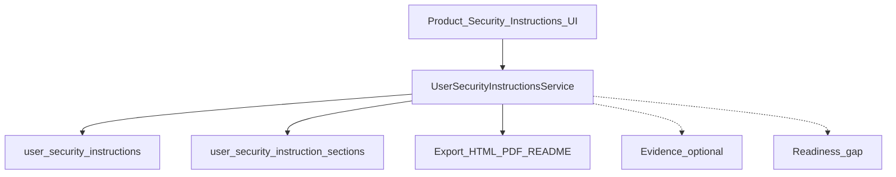

# Phase 2.4 — User Security Instructions

**Версия:** 0.10  
**Дата:** 22 юли 2026 г.  
**Статус:** Active — Must Done; Should 7–9 Done; Should 10–11 / Could remaining  
**Родителски документи:**

- [CRA_Compliance_Workspace_Nachalen_Plan.md](CRA_Compliance_Workspace_Nachalen_Plan.md) (§5.17 User Security Instructions, §14)
- [Phase2_3_Release_Closeout.md](Phase2_3_Release_Closeout.md) (Closed — Phase 2.3 exited)
- [Phase2_3_Policy_Auditor_AI.md](Phase2_3_Policy_Auditor_AI.md) (Closed)

> **Цел на вълната:** product-scoped **User Security Instructions** (структурирани секции + export формати) като SDL / customer-facing security documentation workspace — след затворен Phase 2.3.

> **Ред на имплементация (предложен):** schema + CRUD → section templates EN/BG → export (HTML/PDF/README) → evidence/readiness hooks → AI assist (optional Could).

---

## 1. Цел

Да може производителят да:

- поддържа **структурирани security instructions** за продукт (и по желание за версия);
- покрива секциите от §5.17 (install, config, encryption, updates, vuln reporting, EoS…);
- експортира към **HTML / PDF / README / release package** (и по-късно customer-specific guide);
- свърже инструкциите с evidence / readiness / passport където има смисъл;
- ползва AI само като **draft helper** с human review (не автономен author).

---

## 2. Scope (in)

| Възможност            | Описание                                                         |
| --------------------- | ---------------------------------------------------------------- |
| Instructions document | Product-scoped (optional version pin) structured document        |
| Section model         | Fixed section keys от §5.17 + markdown/body per section          |
| Lifecycle             | `draft` → `under_review` → `published` → `retired` (уточнява се) |
| Templates             | EN/BG starter content per section                                |
| Export                | HTML + PDF minimum; README / release bundle Should               |
| Evidence link         | Optional publish published doc като Evidence                     |
| Readiness hint        | Gap когато липсва published instructions за in-scope product     |
| UI                    | Product module + DataTable index pattern                         |

### Section keys (§5.17 — draft enum)

- `secure_installation`
- `minimum_environment`
- `required_permissions`
- `secure_configuration`
- `default_settings`
- `encryption_requirements`
- `backup`
- `logging`
- `update_procedure`
- `security_contact`
- `vulnerability_reporting`
- `support_period`
- `end_of_support_behavior`
- `known_limitations`

### Export targets (§5.17)

| Format                               | Слой (предложение) |
| ------------------------------------ | ------------------ |
| HTML                                 | Must               |
| PDF                                  | Must               |
| README (markdown)                    | Should             |
| Release package document             | Should             |
| Customer-specific installation guide | Could              |

---

## 3. Scope (out) — изрично

- Автоматично генериране без human review / авто-publish към клиенти
- Пълен CMS / collaborative real-time editing
- Customer self-service portal за инструкции (Phase 2.2 out-of-scope)
- Notified-body submission на instructions
- Заместване на org Policy library (2.3A) — това са **product user-facing** docs, не org policies
- Billing / SSO за distribution

---

## 4. Архитектура (чернова)



### Права (предложение)

| Действие         | Permission                                   |
| ---------------- | -------------------------------------------- |
| View             | `products.view`                              |
| Manage / publish | `products.manage`                            |
| Export           | `products.view` (published) / manage (draft) |

### UI conventions

- Index: server-side `DataTable` + `useApiTable` (като products modules).
- Edit: section list + markdown body + preview (reuse policy Markdown helpers където е възможно).
- shadcn-vue controls; Switch за boolean flags; стандартни Lucide action icons.

### Navigation (предложение)

| Къде                    | Route                                       |
| ----------------------- | ------------------------------------------- |
| Product module          | `/products/{product}/security-instructions` |
| Optional version filter | query `product_version_id`                  |

---

## 5. Данни (чернова схема)

### `user_security_instructions`

| Колона             | Тип                | Бележки                                    |
| ------------------ | ------------------ | ------------------------------------------ |
| id                 | bigint PK          |                                            |
| organization_id    | FK                 | tenant                                     |
| product_id         | FK                 |                                            |
| product_version_id | FK nullable        | null = product-wide                        |
| title              | string             |                                            |
| status             | string             | draft / under_review / published / retired |
| version_label      | string             | e.g. `1.0`                                 |
| locale             | string             | `en` / `bg`                                |
| supersedes_id      | FK nullable        | previous revision                          |
| published_at       | timestamp nullable |                                            |
| published_by       | FK nullable        |                                            |
| evidence_id        | FK nullable        | after publish                              |
| notes              | text nullable      |                                            |
| timestamps         |                    |                                            |

### `user_security_instruction_sections`

| Колона         | Тип                           | Бележки      |
| -------------- | ----------------------------- | ------------ |
| id             | bigint PK                     |              |
| instruction_id | FK                            |              |
| section_key    | string                        | enum §2      |
| title_override | string nullable               |              |
| body           | longText                      | markdown     |
| sort_order     | int                           |              |
| is_applicable  | bool                          | default true |
| timestamps     |                               |              |
| unique         | (instruction_id, section_key) |              |

---

## 6. API / routes (чернова)

```text
GET    /products/{product}/security-instructions
POST   /products/{product}/security-instructions
GET    /products/{product}/security-instructions/{instruction}/edit
PUT    /products/{product}/security-instructions/{instruction}
DELETE /products/{product}/security-instructions/{instruction}
POST   /products/{product}/security-instructions/{instruction}/submit-review
POST   /products/{product}/security-instructions/{instruction}/publish
POST   /products/{product}/security-instructions/{instruction}/publish-evidence
POST   /products/{product}/security-instructions/{instruction}/retire
GET    /products/{product}/security-instructions/{instruction}/export/{format}
GET    /internal-api/products/{product}/security-instructions
```

---

## 7. Имплементационен ред (Must → Should → Could)

### Must

1. Migrations + models + enums (instruction + sections) — **Done**
2. CRUD + section editor (product-scoped) — **Done**
3. Lifecycle draft → publish (минимален) — **Done**
4. Starter templates EN/BG per section key — **Done**
5. Export HTML + PDF — **Done** (2026-07-22)
6. i18n EN/BG + feature tests (CRUD + viewer forbidden manage) — **Done** (2026-07-22)

### Should

7. README / release-package markdown export — **Done** (2026-07-22)
8. Readiness gap `security_instructions_missing` — **Done** (2026-07-22)
9. Publish published instructions → Evidence — **Done** (2026-07-22)
10. Version-pinned instructions (`product_version_id`)
11. Markdown preview (reuse 2.3A helpers)

### Could

12. Customer-specific installation guide variant
13. AI draft per section (human review; reuse AiProvider)
14. Diff between superseding versions
15. Task on submit-for-review
16. Multi-locale document pairs (en/bg linked)

---

## 8. MVP slice за 2.4 (резюме)

**Must** — structured instructions + section templates + HTML/PDF export + tests.

**Should** — README export, readiness gap, evidence publish, version pin.

**Could** — customer-specific guide, AI section drafts, diff/tasks/locales.

---

## 9. Acceptance criteria (Phase 2.4 done) — чернова

1. Owner създава instructions за продукт и попълва задължителните секции (или маркира N/A с rationale).
2. Owner publish-ва документ; Viewer вижда/export-ва published, но не edit-ва.
3. HTML и PDF export са налични и одитируеми.
4. Readiness показва gap при липса на published instructions (ако Should 8 е в scope).
5. Промените са в audit log.
6. AI (ако Could) не publish-ва и не overwrite-ва без human confirmation.

---

## 10. Рискове и mitigations

| Риск                       | Mitigation                                                  |
| -------------------------- | ----------------------------------------------------------- |
| Объркване с org policies   | Ясен UI label „User security instructions“; отделна таблица |
| Празни задължителни секции | `is_applicable` + readiness / publish validation            |
| Export drift               | Един renderer → HTML/PDF/README                             |
| AI overwrite               | Draft-only suggestions; no auto-publish                     |

---

## 11. Зависимости и ред

```text
Phase 2.3 Policy / Auditor / AI — Closed 2026-07-22
    ↓
Phase 2.4 User Security Instructions (този документ)
    ↓
(по-късно) SDL workspace extensions / release packaging polish — TBD
```

Reuse от Phase 2.3:

- Markdown preview helpers (policy);
- Evidence publish pattern;
- Readiness gap pattern;
- Optional AiProvider for section drafts;
- AuditLogger / RBAC conventions.

---

## 12. История

| Версия | Дата       | Промяна                                             |
| ------ | ---------- | --------------------------------------------------- |
| 0.10   | 2026-07-22 | Should 9: publish published instructions → Evidence |
| 0.9    | 2026-07-22 | Should 8: readiness `security_instructions_missing` |
| 0.8    | 2026-07-22 | Should 7: README markdown + release ZIP export      |
| 0.7    | 2026-07-22 | Must 6: i18n verified + CRUD/RBAC feature tests     |
| 0.6    | 2026-07-22 | Must 5: HTML + PDF export + audit + RBAC            |
| 0.5    | 2026-07-22 | Must 4: EN/BG section starter templates             |
| 0.4    | 2026-07-22 | Must 3: submit / publish / retire lifecycle         |
| 0.3    | 2026-07-22 | Must 2: product CRUD + section editor + tests       |
| 0.2    | 2026-07-22 | Must 1: enums, migrations, models + smoke tests     |
| 0.1    | 2026-07-22 | Първоначален skeleton след Phase 2.3 closeout       |
