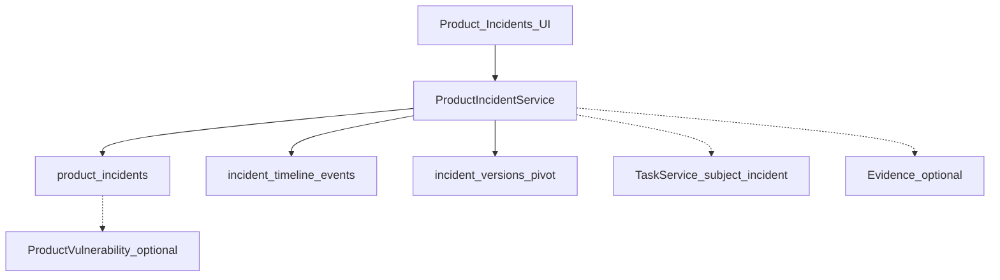

# Phase 2.5 — Security Incident Management

**Версия:** 1.8  
**Дата:** 23 юли 2026 г.  
**Статус:** Active — Could in progress (Must 1–6 + Should 7–12 + Could 13–17 done)  
**Родителски документи:**

- [CRA_Compliance_Workspace_Nachalen_Plan.md](CRA_Compliance_Workspace_Nachalen_Plan.md) (§5.10 Security Incident Management, §5.9 Vulnerability, §5.11 Reporting)
- [Phase2_4_Release_Closeout.md](Phase2_4_Release_Closeout.md) (Closed — Phase 2.4 exited; §8 кандидат A)
- [MVP_Release_Closeout.md](MVP_Release_Closeout.md) (P2 #10 — deferred Incident module)

> **Цел на вълната:** product-scoped **Security Incident** register като **отделен обект** от vulnerability (§5.10), с одитируем timeline и връзки към vuln / tasks / evidence — след затворен Phase 2.4.

> **Ред на имплементация (предложен):** schema + CRUD → timeline → vuln link + tasks → RBAC/tests → Should (customers, closure, export, dashboard) → Could (authority reports, AI summary, CIA fields).

> **Граница с §5.11:** CRA vulnerability reporting wizard (24h/72h/final) остава **само върху `ProductVulnerability`**. Incident authority reporting е отделен Could — reuse на approval/export **pattern**, не на `VulnerabilityReportingService`.

---

## 1. Цел

Да може производителят да:

- регистрира **security incidents** отделно от vulnerabilities;
- пази **timeline** (start / detection / awareness / classification / key events);
- свързва incident с **linked vulnerability**, affected versions, tasks и evidence;
- затваря incident с проследимост (approval / lessons learned — Should/Could);
- **не** дублира vuln disclosure reporting и **не** обещава SRP/ENISA auto-submit.

---

## 2. Scope (in)

| Възможност           | Описание                                                              |
| -------------------- | --------------------------------------------------------------------- |
| Incident register    | Product-scoped CRUD + status lifecycle                                |
| Timeline             | Append-only events + core timestamp fields (§5.10)                    |
| Linked vulnerability | Optional FK; create vuln with discovery `incident_investigation`      |
| Affected versions    | Pivot / multi-select (reuse product versions)                         |
| Affected customers   | Pivot / multi-select (org customers)                                  |
| Affected deployments | Pivot / multi-select (product deployments)                            |
| Tasks                | `subject_type: incident` в `TaskService`                              |
| Audit                | Create / update / status / timeline events                            |
| UI                   | Product module + server-side `DataTable` (като vulnerabilities / USI) |

### Status lifecycle (предложение)

```text
open → investigating → contained → closed
         ↘ cancelled (optional)
```

### Core timestamps (§5.10)

| Поле                | Значение                           |
| ------------------- | ---------------------------------- |
| `actual_started_at` | Кога събитието е започнало         |
| `detected_at`       | Кога е открито                     |
| `awareness_at`      | Кога организацията е станала aware |
| `classified_at`     | Кога е класифицирано като incident |

---

## 3. Scope (out) — изрично

- Full incident orchestration / SOAR (§11 „full incident orchestration“)
- Автоматично SRP / ENISA submission
- Заместване или merge с `VulnerabilityReportingService` (24h/72h/final)
- Customer self-service incident portal
- Real-time SIEM / log ingestion
- Penetration-testing / scanner engine
- Billing / SSO-специфични incident tiers

---

## 4. Архитектура (чернова)



### Права (предложение)

| Действие       | Permission (предложение)                                      |
| -------------- | ------------------------------------------------------------- |
| View           | `incidents.view` (или reuse `vulnerabilities.view` в Must v1) |
| Manage / close | `incidents.manage`                                            |

> MVP: dedicated `incidents.view` / `incidents.manage` (Should 12). Legacy Must temporarily reused `vulnerabilities.*`.

### UI conventions

- Index: server-side `DataTable` + `useApiTable`.
- Edit: form + Timeline tab + linked vuln / tasks.
- shadcn-vue; Switch за booleans; стандартни Lucide icons.

### Navigation (предложение)

| Къде           | Route                                           |
| -------------- | ----------------------------------------------- |
| Product module | `/products/{product}/incidents`                 |
| Edit           | `/products/{product}/incidents/{incident}/edit` |

---

## 5. Данни (чернова схема)

### `product_incidents`

| Колона                   | Тип                | Бележки                                      |
| ------------------------ | ------------------ | -------------------------------------------- |
| id                       | bigint PK          |                                              |
| organization_id          | FK                 | tenant                                       |
| product_id               | FK                 |                                              |
| title                    | string             |                                              |
| status                   | string             | open / investigating / contained / closed    |
| severity                 | string             | low / medium / high / critical (предложение) |
| confidentiality_impact   | string nullable    | none / low / high (CVSS-style; Could 15)     |
| integrity_impact         | string nullable    | none / low / high                            |
| availability_impact      | string nullable    | none / low / high                            |
| attack_vector            | string nullable    | network / adjacent / local / physical        |
| summary                  | text nullable      |                                              |
| root_cause               | text nullable      |                                              |
| corrective_measures      | text nullable      |                                              |
| lessons_learned          | text nullable      | Should/Could                                 |
| product_vulnerability_id | FK nullable        | linked vulnerability                         |
| owner_user_id            | FK nullable        |                                              |
| actual_started_at        | timestamp nullable |                                              |
| detected_at              | timestamp nullable |                                              |
| awareness_at             | timestamp nullable |                                              |
| classified_at            | timestamp nullable |                                              |
| closed_at                | timestamp nullable |                                              |
| closed_by                | FK nullable        |                                              |
| notes                    | text nullable      |                                              |
| timestamps               |                    |                                              |

### `incident_timeline_events`

| Колона      | Тип           | Бележки                               |
| ----------- | ------------- | ------------------------------------- |
| id          | bigint PK     |                                       |
| incident_id | FK            |                                       |
| occurred_at | timestamp     |                                       |
| label       | string        | e.g. „Customer report“                |
| notes       | text nullable |                                       |
| created_by  | FK nullable   |                                       |
| timestamps  |               | append-oriented; no soft edit in Must |

### `incident_product_versions` (pivot)

| Колона                                  | Тип |
| --------------------------------------- | --- |
| incident_id                             | FK  |
| product_version_id                      | FK  |
| unique(incident_id, product_version_id) |     |

### `incident_customers` (pivot)

| Колона                           | Тип |
| -------------------------------- | --- |
| incident_id                      | FK  |
| customer_id                      | FK  |
| unique(incident_id, customer_id) |     |

### `incident_product_deployments` (pivot)

| Колона                                     | Тип |
| ------------------------------------------ | --- |
| incident_id                                | FK  |
| product_deployment_id                      | FK  |
| unique(incident_id, product_deployment_id) |     |

### Опционално по-късно (Could)

- ~~`incident_reports` (authority submission records)~~ **Done (Could 13)**
- ~~`incident_customer_communications` (customer outreach log; ≠ patch campaigns)~~ **Done (Could 14)**
- ~~CIA impact + attack vector enums~~ **Done (Could 15)**
- ~~lessons learned → evidence / controls M2M~~ **Done (Could 17)**

Aligns loosely with Nachalen §9 entity list (`incidents`, `incident_timelines`, `incident_reports`).

---

## 6. API / routes (чернова)

```text
GET    /products/{product}/incidents
POST   /products/{product}/incidents
GET    /products/{product}/incidents/{incident}/edit
PUT    /products/{product}/incidents/{incident}
DELETE /products/{product}/incidents/{incident}
POST   /products/{product}/incidents/{incident}/timeline
POST   /products/{product}/incidents/{incident}/link-vulnerability
DELETE /products/{product}/incidents/{incident}/vulnerability
POST   /products/{product}/incidents/{incident}/create-vulnerability
POST   /products/{product}/incidents/{incident}/status
GET    /internal-api/products/{product}/incidents
```

Should/Could (по-късно):

```text
POST   /products/{product}/incidents/{incident}/close
GET    /products/{product}/incidents/{incident}/export/{format}
POST   /products/{product}/incidents/{incident}/ai-draft
```

---

## 7. Имплементационен ред (Must → Should → Could)

### Must

1. ~~Migrations + models + enums (incident, timeline, version pivot)~~ **Done**
2. ~~CRUD + Index DataTable (product-scoped)~~ **Done**
3. ~~Timeline UI (append events) + core timestamp fields~~ **Done**
4. ~~Link / create vulnerability (`incident_investigation` discovery)~~ **Done**
5. ~~Task subject `incident` + basic audit events~~ **Done**
6. ~~i18n EN/BG + feature tests (CRUD + viewer forbidden manage)~~ **Done**

### Should

7. ~~Affected customers / deployments multi-select~~ **Done**
8. ~~Closure flow (closed_at / closed_by + optional approval task)~~ **Done**
9. ~~Root cause + corrective measures on Edit (if not already in Must form)~~ **Done**
10. ~~Dashboard counts (`open_incidents`, unclassified)~~ **Done**
11. ~~PDF/Markdown incident summary export~~ **Done**
12. ~~Product module nav card + dedicated `incidents.*` permissions~~ **Done**

### Could

13. ~~Authority reports (`incident_reports`) — manual submission record~~ **Done**
14. ~~Customer communications log (отделно от patch campaigns)~~ **Done**
15. ~~CIA impacts + attack vector enums~~ **Done**
16. ~~AI `incident_summary` draft (human review)~~ **Done**
17. ~~Lessons learned → evidence / controls link~~ **Done**
18. Org-level cross-product incident index

---

## 8. MVP slice за 2.5 (резюме)

**Must** — incident ≠ vuln; register + timeline + vuln link + tasks + tests.

**Should** — customers, closure, dashboard, export, dedicated permissions.

**Could** — authority reports, AI summary, CIA fields, org-wide index.

---

## 9. Acceptance criteria (Phase 2.5 done) — чернова

1. Owner създава incident за продукт и записва awareness / classification timestamps.
2. Owner добавя timeline events; историята е одитируема.
3. Incident може да се свърже с (или да създаде) vulnerability с discovery `incident_investigation`.
4. Viewer вижда incidents, но не manage-ва.
5. Task може да сочи към incident (`subject_type=incident`).
6. Vulnerability reporting wizard **не** се замества и остава върху vuln обекта.
7. Няма SRP auto-submit / full orchestration в scope.

---

## 10. Рискове и mitigations

| Риск                                | Mitigation                                                    |
| ----------------------------------- | ------------------------------------------------------------- |
| Объркване incident ↔ vuln reporting | Ясни labels; отделни routes/UI; без споделен reporting wizard |
| Дублиране на deadline engine        | CRA 24h/72h остава само в `VulnerabilityReportingService`     |
| Празен timeline                     | Require `awareness_at` преди contained/closed (уточнява се)   |
| Scope creep към SOAR                | §3 out-of-scope; Could списъкът е explicit gate               |

---

## 11. Зависимости и ред

```text
Phase 2.4 User Security Instructions — Closed 2026-07-23
    ↓
Phase 2.5 Security Incident Management (този документ)
    ↓
(по-късно) SDL / Tech docs / Integration wave 2 — TBD
```

Reuse:

- Vulnerability module UI / RBAC patterns;
- `VulnerabilityDiscoverySource::IncidentInvestigation`;
- `TaskService` morph subjects;
- Deployments / customers (Should);
- `AuditLogger`, DataTable, shadcn-vue conventions;
- Policy type `incident_response` (контекст, не operational register).

---

## 12. История

| Версия | Дата       | Промяна                                                                 |
| ------ | ---------- | ----------------------------------------------------------------------- |
| 1.8    | 2026-07-23 | Could 17 Done — lessons learned links to evidence + controls            |
| 1.7    | 2026-07-23 | Could 16 Done — AI incident summary draft (suggest/apply, no auto-save) |
| 1.6    | 2026-07-23 | Could 15 Done — CIA impacts + attack vector enums on incidents          |
| 1.5    | 2026-07-23 | Could 14 Done — incident customer communications log (append-only)      |
| 1.4    | 2026-07-23 | Could 13 Done — manual authority reports (append-only log)              |
| 1.3    | 2026-07-23 | Should 12 Done — dedicated incidents.* permissions + nav card flag      |
| 1.2    | 2026-07-23 | Should 11 Done — PDF/Markdown incident summary export                   |
| 1.1    | 2026-07-23 | Should 10 Done — dashboard open/unclassified incident counts            |
| 1.0    | 2026-07-23 | Should 9 Done — investigation section; close requires root/corrective   |
| 0.9    | 2026-07-23 | Should 8 Done — close flow, closed_at/by, optional approval task        |
| 0.8    | 2026-07-23 | Should 7 Done — affected customers / deployments multi-select           |
| 0.7    | 2026-07-23 | Must 6 Done — i18n parity + RBAC/CRUD feature coverage                  |
| 0.6    | 2026-07-23 | Must 5 Done — task subject incident + audit events                      |
| 0.5    | 2026-07-23 | Must 4 Done — link/create vulnerability from incident                   |
| 0.4    | 2026-07-23 | Must 3 Done — timeline append UI + core timestamps section              |
| 0.3    | 2026-07-23 | Must 2 Done — CRUD, DataTable, RBAC mirror vulns, tests                 |
| 0.2    | 2026-07-23 | Must 1 Done — enums, migrations, models, smoke tests                    |
| 0.1    | 2026-07-23 | Първоначален skeleton след Phase 2.4 closeout (кандидат A)              |
