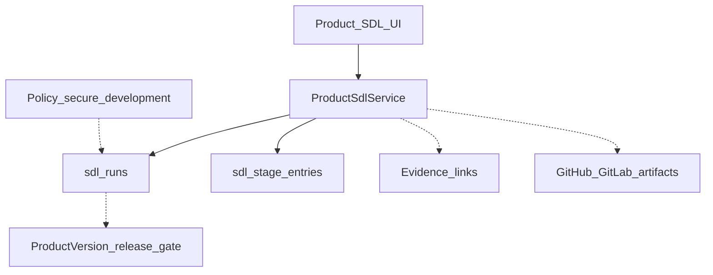

# Phase 2.6 — Secure Development Lifecycle

**Версия:** 1.5  
**Дата:** 23 юли 2026 г.  
**Статус:** Active — Must Done; Should 7–12 Done; Could 13–14 Done  
**Родителски документи:**

- [CRA_Compliance_Workspace_Nachalen_Plan.md](CRA_Compliance_Workspace_Nachalen_Plan.md) (§5.14 Secure Development Lifecycle, §5.13 Evidence, §7 Integrations)
- [Phase2_5_Release_Closeout.md](Phase2_5_Release_Closeout.md) (Closed — Phase 2.5 exited; §8 кандидат B)
- [Phase2_4_Release_Closeout.md](Phase2_4_Release_Closeout.md) (P2 #14 — deferred full SDL workspace)
- [Phase2_1_GitHub_GitLab_Integration.md](Phase2_1_GitHub_GitLab_Integration.md) (Closed — PR / CI / scan evidence hooks)
- [Phase2_3_Policy_Auditor_AI.md](Phase2_3_Policy_Auditor_AI.md) (Closed — `secure_development` policy type)

> **Цел на вълната:** product-scoped **SDL workspace** (§5.14) — проследим lifecycle от security requirement / threat review до release security approval и post-release monitoring — без да дублира Policy library, USI или Incident register.

> **Ред на имплементация (предложен):** schema + stage model → CRUD / board UI → evidence & Git link hooks → release approval gate → checklist templates → readiness/tests → Should/Could.

> **Граница с вече доставеното:** org Policy `secure_development` остава **policy документ**; USI (§5.17) е customer-facing; GitHub/GitLab (2.1) е **източник на evidence**, не SDL board. Phase 2.6 свързва тези артефакти в operational workflow.

---

## 1. Цел

Да може производителят да:

- води **SDL stages** за продукт / версия / feature work item;
- записва **threat considerations**, secure coding checklist, peer review и security tests;
- свързва етапи с **evidence** (PR, CI, scan, test report) и **controls**;
- изисква **release security approval** преди publication;
- управлява **exceptions** с owner + expiry;
- вижда post-release **monitoring** hooks (без SIEM engine).

---

## 2. Scope (in)

| Възможност            | Описание                                                         |
| --------------------- | ---------------------------------------------------------------- |
| SDL work item / run   | Product-scoped (optional version pin) lifecycle record           |
| Stage workflow        | Fixed stages от §5.14 (виж по-долу)                              |
| Security requirements | Link към product requirements / controls или free-text checklist |
| Threat considerations | Structured notes / checklist per stage                           |
| Peer review evidence  | Link към Git PR / Evidence record                                |
| Scan / test results   | Link към integration artifacts / Evidence                        |
| Release security gate | Approval before marking release-ready                            |
| Exceptions            | Documented deviation + owner + review date                       |
| Tasks                 | `subject_type: sdl_run` (или еквивалент)                         |
| Audit                 | Create / stage change / approval / exception                     |
| UI                    | Product module + server-side `DataTable`                         |

### Stage workflow (§5.14 — draft)

```text
requirement
→ threat_review
→ design
→ development
→ code_review
→ dependency_scan
→ security_test
→ release_approval
→ publication
→ monitoring
```

> Уточнение: един „SDL run“ може да е per-version release, per-feature, или lightweight checklist. Schema поддържа optional `product_version_id`; stage rows се seed-ват чрез `SdlRun::ensureStageEntries()`.

---

## 3. Scope (out) — изрично

- Full ALM / Jira clone (Integration wave 2 може да импортира tickets)
- Автоматичен merge gate в GitHub/GitLab (само evidence + approval в workspace)
- Penetration-testing / scanner engine (reuse imports от 2.1 / future wave 2)
- Заместване на Policy library `secure_development`
- Заместване на USI / Technical Documentation workspace (§5.12 — кандидат C)
- SIEM / real-time monitoring pipeline
- Billing / SSO-специфични SDL tiers

---

## 4. Архитектура (чернова)



### Права

| Действие         | Permission                                     |
| ---------------- | ---------------------------------------------- |
| View             | `sdl.view`                                     |
| Manage / approve | `sdl.manage` (approve gate included in manage) |

Nav card: `can_view_sdl` (product modules).

### UI conventions

- Index: server-side `DataTable` + `useApiTable`.
- Edit: stage checklist + evidence links + approval panel.
- shadcn-vue; Switch за booleans; стандартни Lucide icons.

### Navigation

| Къде           | Route                                |
| -------------- | ------------------------------------ |
| Product module | `/products/{product}/sdl`            |
| Edit           | `/products/{product}/sdl/{run}/edit` |
| Org index      | `/sdl` cross-product index           |

---

## 5. Данни (чернова схема)

### `sdl_runs` (работно име)

| Колона             | Тип                | Бележки                                    |
| ------------------ | ------------------ | ------------------------------------------ |
| id                 | bigint PK          |                                            |
| organization_id    | FK                 | tenant                                     |
| product_id         | FK                 |                                            |
| product_version_id | FK nullable        | version pin                                |
| title              | string             | feature / release label                    |
| status             | string             | draft / in_progress / approved / blocked … |
| current_stage      | string             | enum stage key                             |
| owner_user_id      | FK nullable        |                                            |
| approved_at        | timestamp nullable | release security approval                  |
| approved_by        | FK nullable        |                                            |
| notes              | text nullable      |                                            |

### `sdl_stage_entries`

| Колона       | Тип            | Бележки                         |
| ------------ | -------------- | ------------------------------- |
| id           | bigint PK      |                                 |
| sdl_run_id   | FK             |                                 |
| stage        | string         | fixed key                       |
| status       | string         | pending / done / na / exception |
| completed_at | timestamp null |                                 |
| completed_by | FK nullable    |                                 |
| notes        | text nullable  | threat / checklist notes        |

### Pivots / links

- ~~`sdl_run_evidence`, `sdl_stage_evidence`~~ **Done (Must 4)**
- `sdl_run_controls` (Should/Could)
- ~~exception records (`sdl_exceptions`)~~ **Done (Should 10)**
- ~~Git artifact references (reuse integration models)~~ **Done (Should 9)**

Aligns loosely with Nachalen §5.14 minimal capabilities.

---

## 6. API / routes (чернова)

```text
GET    /products/{product}/sdl
POST   /products/{product}/sdl
GET    /products/{product}/sdl/{run}/edit
PUT    /products/{product}/sdl/{run}
DELETE /products/{product}/sdl/{run}
POST   /products/{product}/sdl/{run}/stages/{stage}
POST   /products/{product}/sdl/{run}/approve
GET    /internal-api/products/{product}/sdl
GET    /sdl
GET    /internal-api/sdl
```

Should/Could (по-късно):

```text
POST   /products/{product}/sdl/{run}/exceptions
GET    /products/{product}/sdl/{run}/export/{format}
```

---

## 7. Имплементационен ред (Must → Should → Could)

### Must

1. ~~Migrations + models + enums (run, stages, status)~~ **Done**
2. ~~CRUD + Index DataTable (product-scoped)~~ **Done**
3. ~~Stage checklist UI (complete / N/A + notes)~~ **Done**
4. ~~Evidence link на stage / run~~ **Done**
5. ~~Release security approval gate + audit~~ **Done**
6. ~~i18n EN/BG + feature tests (CRUD + viewer forbidden manage)~~ **Done**

### Should

7. ~~Version-pinned SDL runs~~ **Done**
8. ~~Secure coding / threat checklist templates EN/BG~~ **Done**
9. ~~GitHub/GitLab PR / CI artifact quick-link (reuse 2.1)~~ **Done**
10. ~~Exception handling (owner + expiry + task)~~ **Done**
11. ~~Readiness gap `sdl_release_approval_missing` (за in-scope release)~~ **Done**
12. ~~Dedicated `sdl.*` permissions + product nav card~~ **Done**

### Could

13. ~~Org-level cross-product SDL index~~ **Done**
14. ~~AI draft for threat notes / checklist (human review)~~ **Done**
15. Export PDF/Markdown SDL summary for release package
16. Auto-suggest evidence from recent Git sync
17. Post-release monitoring checklist + dashboard counts
18. Link SDL run → published USI / tech-doc delta (light)

---

## 8. MVP slice за 2.6 (резюме)

**Must** — SDL run ≠ policy; stages + evidence + release approval + tests.

**Should** — version pin, templates, Git links, exceptions, readiness, dedicated RBAC.

**Could** — org index, AI drafts, export, auto-suggest evidence, monitoring, USI/tech-doc links.

---

## 9. Acceptance criteria (Phase 2.6 done) — чернова

1. Owner създава SDL run за продукт и преминава през stage checklist.
2. Stage completion е одитируема; N/A / exception са явни.
3. Evidence може да се свърже към run/stage.
4. Release security approval е задължителен gate преди „approved“ status.
5. Viewer вижда SDL, но не manage / approve-ва.
6. Org Policy `secure_development` и USI **не** се заместват.
7. Няма Git merge-block enforcement / scanner engine в scope.

---

## 10. Рискове и mitigations

| Риск                              | Mitigation                                                   |
| --------------------------------- | ------------------------------------------------------------ |
| Дублиране с Tasks / Evidence only | SDL е structured stage board; Tasks/Evidence са attachments  |
| Объркване с Policy SDL документ   | Labels: „SDL run / workspace“ vs „Secure development policy“ |
| Scope creep към Jira              | Out-of-scope ALM; Integration wave 2 за ticket import        |
| Твърде тежък per-commit process   | Allow version-level runs + N/A stages with rationale         |

---

## 11. Зависимости и ред

```text
Phase 2.5 Security Incident Management — Closed 2026-07-23
    ↓
Phase 2.6 Secure Development Lifecycle (този документ)
    ↓
(по-късно) Tech docs polish / Integration wave 2 — TBD
```

Reuse:

- Phase 2.1 Git artifacts / sync patterns;
- Evidence + Controls + Tasks;
- Policy type `secure_development` (контекст, не operational board);
- Product versions / release flows;
- `AuditLogger`, DataTable, shadcn-vue conventions;
- AI provider pattern от 2.3C / 2.4 / 2.5 (Could).

---

## 12. История

| Версия | Дата       | Промяна                                                                                    |
| ------ | ---------- | ------------------------------------------------------------------------------------------ |
| 1.5    | 2026-07-23 | Could 14 Done — AI draft for SDL stage notes / checklist (suggest → preview → apply local) |
| 1.4    | 2026-07-23 | Could 13 Done — org-level cross-product SDL index + sidebar                                |
| 1.3    | 2026-07-23 | Should 12 Done — `sdl.view` / `sdl.manage` + `can_view_sdl` nav card                       |
| 1.2    | 2026-07-23 | Should 11 Done — readiness gap `sdl_release_approval_missing`                              |
| 1.1    | 2026-07-23 | Should 10 Done — exception owner + expiry + follow-up task                                 |
| 1.0    | 2026-07-23 | Should 9 Done — Git/CI quick-link (sync snapshots + PR URL evidence)                       |
| 0.9    | 2026-07-23 | Should 8 Done — EN/BG secure coding & threat checklist templates                           |
| 0.8    | 2026-07-23 | Should 7 Done — version-pinned SDL runs + index/API filter                                 |
| 0.7    | 2026-07-23 | Must 6 Done — EN/BG i18n parity + RBAC/CRUD feature tests                                  |
| 0.6    | 2026-07-23 | Must 5 Done — release security approval gate, lock, revoke + audit                         |
| 0.5    | 2026-07-23 | Must 4 Done — evidence links on SDL run + stage entries                                    |
| 0.4    | 2026-07-23 | Must 3 Done — stage checklist UI (done/N/A/exception + notes)                              |
| 0.3    | 2026-07-23 | Must 2 Done — product SDL CRUD + DataTable + module card                                   |
| 0.2    | 2026-07-23 | Must 1 Done — `sdl_runs` / `sdl_stage_entries` + enums + model tests                       |
| 0.1    | 2026-07-23 | Skeleton след Phase 2.5 closeout — §5.14 SDL workspace (кандидат B)                        |
