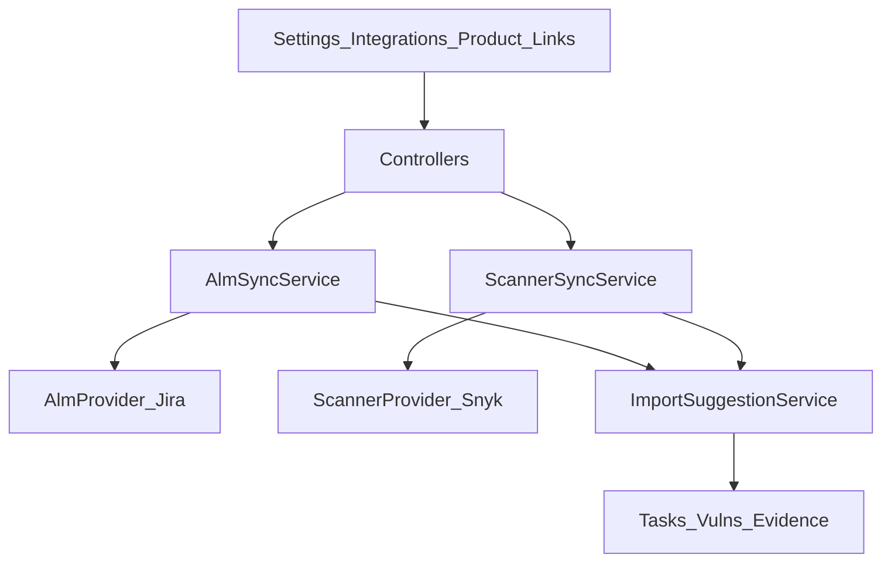

# Phase 2.8 — Integration Wave 2

**Версия:** 0.11  
**Дата:** 24 юли 2026 г.  
**Статус:** Active — Must Done; Should 7–9 Done; Should 10–12 / Could open  
**Родителски документи:**

- [CRA_Compliance_Workspace_Nachalen_Plan.md](CRA_Compliance_Workspace_Nachalen_Plan.md) (§7 Интеграции — Втора вълна, §14)
- [Phase2_7_Release_Closeout.md](Phase2_7_Release_Closeout.md) (Closed — Phase 2.7 exited; §8 кандидат D)
- [Phase2_1_GitHub_GitLab_Integration.md](Phase2_1_GitHub_GitLab_Integration.md) (Closed — първа интеграционна вълна; connector patterns)

> **Цел на вълната:** втора интеграционна вълна (§7) — **compliance-relevant** import от ALM + scanner tooling, с **human review gate** (Accept/Dismiss), без Jira clone и без собствен scanner engine.

> **Ред на имплементация (предложен):** shared integration framework → Jira ALM MVP → Snyk scanner MVP → audit/RBAC/tests → schedule/webhooks/mapping → Could depth.

> **Граница с вече доставеното:** Phase 2.1 покрива GitHub/GitLab sync, CI, Dependabot **suggestions**, webhooks, GitHub App. Phase 2.8 **не** пипа VCS контракта; добавя паралелни ALM/scanner connectors и обобщава suggestion review pattern.

---

## 1. Цел

Да може производителят да:

- свърже **Jira Cloud** (org credentials + project/product link) и да импортира compliance-relevant issues като **reviewable** drafts → Tasks / evidence refs;
- свърже **Snyk** и да импортира vulnerability / dependency findings като **reviewable** suggestions → Vulnerability register (като Dependabot в 2.1);
- запази принципа от §7: само ticket / scan / immutable reference данни — не пълен ALM mirror;
- ползва съществуващите Vulnerability / Evidence / Tasks / Readiness модули като consumers;
- разшири Settings → Integrations без да чупи GitHub/GitLab UX.

---

## 2. Scope freeze (решения)

| Решение             | Избор за Phase 2.8 MVP                         | Алтернатива (Should/Could / по-късно)        |
| ------------------- | ---------------------------------------------- | -------------------------------------------- |
| Първи ALM           | **Jira Cloud** (REST API + API token / email)  | Azure DevOps (Should 11)                     |
| Първи scanner       | **Snyk** (REST API + token)                    | Trivy via CI/SARIF artifact (Could 14)       |
| Auth (MVP)          | **API token / PAT** (encrypted at rest)        | OAuth app install UI (Could polish)          |
| Review gate         | Extend **import suggestions** (Accept/Dismiss) | No silent entity create                      |
| VCS tables          | **Не reuse** `organization_vcs_connections`    | Паралелни integration tables                 |
| Queue               | Sync now = `dispatchSync`; schedule = async    | Production worker = ops P1 (кандидат E)      |
| Кандидат E (polish) | **Паралелен**, не блокира 2.8                  | Merged-PR summary, live LLM, queue hardening |

> Остават извън freeze (може да се прецизират при Must 1 без да местят slices): Jira JQL filter defaults; Snyk org/project mapping UX; exact permission slug reuse (`products.manage`) vs future `integrations.manage`.

---

## 3. Scope (in)

| Възможност            | Описание                                                                   |
| --------------------- | -------------------------------------------------------------------------- |
| Integration framework | Org connections + product links + sync runs + import suggestions           |
| Jira ALM import       | Issues (filtered) → suggestion kind `task` / evidence link                 |
| Snyk scanner import   | Findings → suggestion kind `vulnerability` (Accept → ProductVulnerability) |
| Review gate           | Accept / Dismiss; no re-upsert while dismissed                             |
| Evidence hooks        | Immutable refs (URL, external id, synced_at); optional snapshot JSON       |
| Settings UI           | Extend Integrations page (tabs): Jira + Snyk next to GitHub/GitLab         |
| Product UI            | Link project/target + Sync now + pending suggestions list                  |
| RBAC                  | Connect/sync/accept: `products.manage`; viewer read-only                   |
| Schedule / webhooks   | Should — reuse `off`/`hourly`/`daily` + vendor webhooks where feasible     |

### Кандидати от Nachalen §7 — покритие в 2.8

| Кандидат                 | Phase 2.8                                   |
| ------------------------ | ------------------------------------------- |
| Jira                     | **Must**                                    |
| Snyk                     | **Must**                                    |
| Azure DevOps             | **Should 11** (втори ALM)                   |
| Trivy / SARIF            | **Could 14**                                |
| Renovate / Dependabot+   | **Could 13** (depth beyond 2.1 suggestions) |
| SonarQube                | **Could 14** (или Phase 2.9)                |
| Container registries     | Out / Phase 2.9                             |
| Customer support systems | **Could 15** (light link only)              |
| OWASP Dependency-Check   | Out / Phase 2.9 (overlap with Snyk/Trivy)   |

---

## 4. Scope (out) — изрично

- Full ALM clone / two-way sync (CRA → Jira create/update на всички fields)
- Собствен vulnerability scanner / pen-test engine
- Silent auto-create на vulnerabilities или tasks без Accept
- Пренаписване на Phase 2.1 VCS models / GitHub/GitLab flows
- SRP / ENISA auto-submit
- Billing / SSO (platform track)
- DoC auto-sign / notified-body portal
- Merged-PR summary (кандидат E — deferred от 2.1)

---

## 5. Архитектура



### Contracts (нови — VCS остава недокоснат)

`App\Contracts\AlmProvider`:

- `verifyConnection(): void`
- `listProjects(): array`
- `listIssues(ProductIntegrationLink $link, array $cursor = []): array`

`App\Contracts\ScannerProvider`:

- `verifyConnection(): void`
- `listTargets(): array` (orgs/projects)
- `listFindings(ProductIntegrationLink $link, array $cursor = []): array`

Adapters (Must): `JiraCloudProvider`, `SnykApiProvider` — Laravel HTTP client; тестове с `Http::fake()`.

### Reuse от 2.1 (pattern, не таблици)

- Encrypted credentials + verify-on-connect
- Sync run status machine + `last_sync_summary`
- Upsert suggestions by `(link_id, kind, external_id)`
- Accept / Dismiss UX на Product Edit
- Evidence `integration_snapshot` type (reuse enum; payload source = `jira` / `snyk`)
- Schedule enum `off` / `hourly` / `daily` + artisan command
- Audit events; never log tokens (`AuditLogger::SENSITIVE_KEYS`)

---

## 6. Данни (чернова)

```text
organization_integrations
  id, organization_id
  provider          # jira | snyk | azure_devops | …
  category          # alm | scanner
  auth_type         # api_token | (later oauth)
  credentials_json  # encrypted cast (email+token / api_token / …)
  label, status     # active | invalid | revoked
  sync_schedule     # off | hourly | daily
  last_verified_at, timestamps
  unique(organization_id, provider)

product_integration_links
  id, product_id, integration_id
  external_project_key / external_target_id
  external_label, config_json   # JQL / severity filter / …
  last_synced_at, last_sync_summary
  timestamps
  unique(product_id, integration_id)  # one link per provider per product (MVP)

integration_sync_runs
  id, link_id, status, triggered_by?
  started_at, finished_at, summary_json
  timestamps

import_suggestions
  id, link_id
  kind              # task | vulnerability | evidence_ref
  external_id, title, status   # pending | accepted | dismissed
  payload_json
  accepted_entity_type?, accepted_entity_id?
  timestamps
  unique(link_id, kind, external_id)
```

> Алтернатива при имплементация: преименувани/обобщени имена — важното е **да не** се бутат FK към `product_repositories` / `vcs_import_suggestions`. Опционален follow-up (извън Must): migrate VCS suggestions към общия `import_suggestions` — **не** в 2.8 Must.

Enums / audit (нови):

- `IntegrationProvider`, `IntegrationCategory`, `IntegrationConnectionStatus`, `ImportSuggestionKind`, `ImportSuggestionStatus`
- Audit: `integration_connected`, `integration_disconnected`, `integration_sync_*`, `import_suggestion_accepted`, `import_suggestion_dismissed`

---

## 7. UI / UX / routes (чернова)

### Settings — Integrations

- Разшири `resources/js/pages/settings/Integrations.vue` с tabs/sections: **Jira**, **Snyk** (до GitHub/GitLab)
- Connect / update token / disconnect / sync schedule
- Без raw secrets в Inertia props

### Product — Integration links + suggestions

- Product Edit (или compact panel): link Jira project + Snyk target; **Sync now**; pending suggestions
- Accept task → create/link `Task` (subject product; optional external URL)
- Accept vulnerability → `ProductVulnerability` (`discovery_source` scanner / integration)
- Dismiss → status dismissed

### Routes (предложение)

```text
# Settings
POST   /settings/integrations/jira
POST   /settings/integrations/snyk
PUT    /settings/integrations/{integration}/schedule
DELETE /settings/integrations/{integration}

# Product
PUT    /products/{product}/integrations/{provider}
DELETE /products/{product}/integrations/{provider}
POST   /products/{product}/integrations/{provider}/sync
POST   /products/{product}/import-suggestions/{suggestion}/accept
POST   /products/{product}/import-suggestions/{suggestion}/dismiss

# Optional Should
POST   /api/webhooks/jira/{integration}
POST   /api/webhooks/snyk/{integration}
```

### Readiness / dashboard (Should)

- Gaps / counts: open pending import suggestions; failing integration sync
- Dashboard chip: `pending_import_suggestions` (org or product)

---

## 8. Имплементационен ред (Must → Should → Could)

### Must

1. ~~Migrations + models + enums (`organization_integrations`, links, sync runs, `import_suggestions`)~~ **Done** (2026-07-24)
2. ~~Settings UI: connect / verify / disconnect **Jira Cloud** (API token) + audit~~ **Done** (2026-07-24)
3. ~~Product ↔ Jira project link + Sync now (issues → pending `task` suggestions) + Accept/Dismiss → Task~~ **Done** (2026-07-24)
4. ~~Settings UI: connect / verify / disconnect **Snyk** + Product link + Sync now (findings → `vulnerability` suggestions) + Accept → ProductVulnerability~~ **Done** (2026-07-24)
5. ~~Evidence immutable ref / optional snapshot on successful sync; AuditLogger coverage~~ **Done** (2026-07-24)
6. ~~i18n EN/BG + feature tests (`Http::fake()`; viewer cannot manage connectors / accept)~~ **Done** (2026-07-24)

### Should

7. ~~Scheduled sync (`off`/`hourly`/`daily`) + `integrations:sync-scheduled` artisan + scheduler entry~~ **Done** (2026-07-24)
8. ~~Manual sync hardening (unique job, soft-fail on missing scopes, last_error in summary)~~ **Done** (2026-07-24)
9. ~~Map Snyk findings → existing SBOM / `product_components` where purl/name matches~~ **Done** (2026-07-24)
10. Readiness gaps + dashboard counts for pending suggestions / failed syncs
11. Second ALM: **Azure DevOps** work items (reuse `AlmProvider` + same suggestion UX)
12. Operator docs: secrets, scopes, rate limits, threat model (short `documents/` or runbook section)

### Could

13. Renovate / deeper Dependabot campaign links (beyond 2.1 alert suggestions)
14. Trivy / SARIF (или SonarQube) scanner adapter via uploaded/CI artifact **или** API
15. Customer support system light link (external ticket URL on incident/vuln — ≠ deployments rewrite)
16. AI triage summary for imported findings (human review; no auto-accept)
17. Org-level integrations health index (DataTable: provider, status, last sync, errors)
18. Auditor export: sync health / last-error summary (Markdown/PDF)

---

## 9. MVP slice за 2.8 (резюме)

**Must** — shared integration schema + Jira issues→tasks + Snyk findings→vuln suggestions + review gate + audit/tests.

**Should** — schedule, sync hardening, SBOM mapping, readiness/dashboard, Azure DevOps, ops docs.

**Could** — Renovate/Dependabot+, Trivy/SARIF/Sonar, support-link, AI triage, org health index, auditor sync export.

---

## 10. Acceptance criteria (Phase 2.8 done)

1. Owner свързва Jira Cloud и линква product → project; Sync now създава pending task suggestions.
2. Owner Accept-ва suggestion → създава се Task с external ref; Dismiss не създава entity.
3. Owner свързва Snyk и линква product → target; Sync now създава pending vulnerability suggestions.
4. Accept на finding създава ProductVulnerability; **няма** silent auto-create.
5. Viewer вижда статуси/suggestions (където е позволено read), но **не** manage-ва connectors / sync / accept.
6. Phase 2.1 GitHub/GitLab connect/sync/suggestion flows остават непроменени по контракт.
7. Няма full Jira clone / two-way sync / собствен scanner engine в scope.

---

## 11. Рискове и mitigations

| Риск                                   | Mitigation                                                               |
| -------------------------------------- | ------------------------------------------------------------------------ |
| Scope creep към пълен ALM              | Read-only import + fixed suggestion kinds; no CRA→Jira writes in 2.8     |
| Дублиране с Dependabot suggestions     | Snyk suggestions са отделен provider; Accept дедуп по external id / CVE  |
| Secret leakage                         | Encrypted cast; never in audit details; rotate/disconnect UX             |
| Rate limits / partial API scopes       | Soft-fail + `last_sync_summary.error`; Sync now remains usable           |
| Queue worker missing in prod           | Must Sync now via `dispatchSync`; schedule/webhooks documented as ops P1 |
| Premature generic framework over-build | Two adapters + one suggestion model first; extract only when ADO lands   |

---

## 12. Зависимости и ред

```text
Phase 2.1 GitHub/GitLab — Closed (patterns + Dependabot suggestions)
Phase 2.2–2.7 product modules — Closed
    ↓
Phase 2.8 Integration wave 2 (този документ)
    ↓
(по-късно) Candidate E polish / platform SSO·billing — TBD
```

Reuse:

- Settings Integrations UI; Product Edit suggestion review;
- `ProductVulnerability`, `Task`, Evidence `integration_snapshot`;
- Http::fake feature tests; AuditLogger; scheduler patterns;
- DataTable за Could org health index.

---

## 13. Тестове (план)

| Област            | Предложение                                                                       |
| ----------------- | --------------------------------------------------------------------------------- |
| Models            | `IntegrationWave2ModelsTest` — **Done**                                           |
| Jira connect/sync | `JiraIntegrationSettingsTest` — connect/disconnect **Done**                       |
| Product Jira link | `ProductJiraIntegrationTest` — link/sync/accept/dismiss **Done**                  |
| Snyk connect/sync | `SnykIntegrationTest` — connect/link/sync/accept **Done**                         |
| Evidence snapshot | Jira/Snyk sync → `integration_snapshot` + checksum **Done**                       |
| Accept / dismiss  | Task + vulnerability creation **Done**                                            |
| RBAC              | `IntegrationWave2RbacTest` + settings/product tests **Done**                      |
| Schedule          | `IntegrationScheduledSyncTest` — schedule update + artisan + hourly cron **Done** |
| Sync hardening    | `IntegrationSyncHardeningTest` — unique job + soft-fail + last_error **Done**     |
| SBOM mapping      | `SnykComponentMatchTest` — purl/name match → vulnerability components **Done**    |
| Azure DevOps      | Provider adapter test (Should 11)                                                 |
| Readiness         | Pending suggestions gap (Should 10)                                               |

---

## 14. История

| Версия | Дата       | Промяна                                                                        |
| ------ | ---------- | ------------------------------------------------------------------------------ |
| 0.11   | 2026-07-24 | Should 9 Done — Snyk findings → SBOM/product_components match on sync/accept   |
| 0.10   | 2026-07-24 | Should 8 Done — unique sync job + soft-fail scopes + last_error in summary     |
| 0.9    | 2026-07-24 | Should 7 Done — scheduled sync + `integrations:sync-scheduled` + Settings UI   |
| 0.8    | 2026-07-24 | Must 6 Done — i18n polish + RBAC feature coverage; Must slice complete         |
| 0.7    | 2026-07-24 | Must 5 Done — evidence snapshot on Jira/Snyk sync + audit evidence refs        |
| 0.6    | 2026-07-24 | Must 4 Done — Snyk Settings + Product link/sync → vuln suggestions → Accept    |
| 0.5    | 2026-07-24 | Must 3 Done — Product↔Jira link, sync→task suggestions, Accept/Dismiss→Task    |
| 0.4    | 2026-07-24 | Must 2 Done — Jira Cloud Settings connect/verify/disconnect + audit            |
| 0.3    | 2026-07-24 | Must 1 Done — integration tables/models/enums + audit events + model tests     |
| 0.2    | 2026-07-24 | Full Must/Should/Could; freeze Jira Cloud + Snyk API token; schema/UI/AC/risks |
| 0.1    | 2026-07-24 | Skeleton след Phase 2.7 closeout — §7 Integration wave 2 (кандидат D)          |
