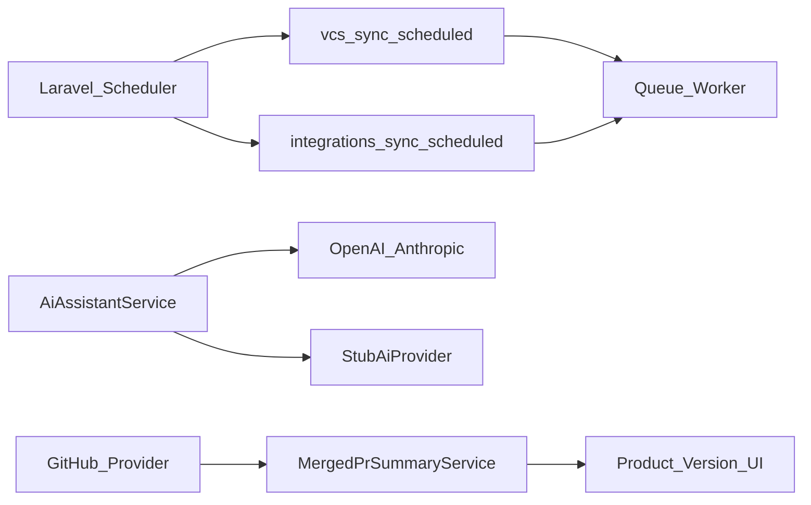

# Phase 2_E — Cross-Phase Polish

**Версия:** 0.2  
**Дата:** 24 юли 2026 г.  
**Статус:** Active — Must/Should/Could **frozen** (Must 1 Done)  
**Родителски документи:**

- [CRA_Compliance_Workspace_Nachalen_Plan.md](CRA_Compliance_Workspace_Nachalen_Plan.md) (§14 следващо планиране — кандидат E; §15–§16 граница с F)
- [Phase2_8_Release_Closeout.md](Phase2_8_Release_Closeout.md) (Closed — Phase 2.8 exited; §8 препоръка → E)
- [Phase2_1_GitHub_GitLab_Integration.md](Phase2_1_GitHub_GitLab_Integration.md) (Closed — merged-PR summary deferred)
- [Phase2_E_Ops_Baseline.md](Phase2_E_Ops_Baseline.md) (Must 1 — scheduler + queue)
- [Phase2_8_Integrations_Operator_Runbook.md](Phase2_8_Integrations_Operator_Runbook.md) (ops: schedule + queue)

> **Цел на вълната:** cross-phase **production reliability + deferred polish** — без нова domain вълна. Отключва scheduled sync в prod, live AI там където stub-ът вече е wired, и GitHub **merged-PR summary** (aspirational от 2.1).

> **Ред на имплементация (фиксиран):** ops/queue baseline → queue hardening → live LLM → tests → merged-PR summary → audit/RBAC → Should/Could.

> **Граница:** Phase 2.1–2.8 са **Closed**. След **Phase 2_E closeout** продуктът се приема за **готов за вътрешно тестване** (отделен test plan). **Candidate F** (SSO / billing / onboarding) започва **чак след** приключване на вътрешните тестове. След F — окончателни тестове, после deploy / клиенти. Optional **2.9** (scanner depth) остава извън тази вълна.

---

## 1. Цел

Да може операторът / организацията да:

- разчита на **scheduled** VCS + integration sync в production (queue worker + documented runbook);
- ползва **live LLM** (OpenAI/Anthropic) за вече доставени AI surfaces, със stub fallback за tests;
- види **merged PRs summary** за product release window (GitHub; human-readable, не auto-create entities);
- има по-ясен ops signal когато schedule/worker/LLM не са здрави — без нова голяма UI платформа.

---

## 2. Scope freeze (решения)

| Решение                 | Избор за Phase 2_E (frozen)                                            | Алтернатива (Should/Could / по-късно)       |
| ----------------------- | ---------------------------------------------------------------------- | ------------------------------------------- |
| Фокус                   | **Polish / ops / deferred 2.1** — не нова §14 domain вълна             | Candidate F / Phase 2.9                     |
| Queue                   | Document + verify `queue:work` + scheduler path (`ops:baseline-check`) | Supervisor/systemd unit templates (Could)   |
| LLM                     | Enable/harden **existing** providers (`openai`/`anthropic`)            | New providers / fine-tuning (out)           |
| Live LLM surfaces       | **Imported-finding triage + vulnerability triage** (Must)              | USI/incident/tech-doc drafts (as-is config) |
| Merged-PR summary       | **GitHub first**; panel на **Product Version** show                    | GitLab parity (Should); AI summary (Could)  |
| Release window          | `released_at` ± **14 дни**; ако няма `released_at` → last **30** дни   | Manual date range (out of Must)             |
| Cache                   | **On-demand** + short HTTP/response cache (~15 min)                    | Nightly DB snapshot (out of Must)           |
| Auto-create entities    | **Не** — summary е informational / optional evidence ref (Should)      | Auto Task/Evidence create (out)             |
| UX debt pack (Could 16) | **Празен** при freeze — само P0 открити по време на 2_E                | Отделен backlog след internal test          |
| SSO / billing           | **Out** → Candidate F (след internal test plan)                        | —                                           |
| New scanners            | **Out** → optional 2.9                                                 | —                                           |
| Post-2_E                | **Internal testing plan** → F → final tests → deploy                   | —                                           |

---

## 3. Scope (in)

| Възможност            | Описание                                                               |
| --------------------- | ---------------------------------------------------------------------- |
| Queue / scheduler ops | Production path за `vcs:sync-scheduled`, `integrations:sync-scheduled` |
| Live LLM              | Config + smoke за triage surfaces (stub в CI)                          |
| Merged-PR summary     | GitHub merged PRs в release window → summary panel (product version)   |
| Ops health signals    | Clear failed-sync / worker-missing hints (reuse health where possible) |
| Docs / tests          | Runbook updates, feature tests с `Http::fake` / queue fake             |

### Източници на backlog (P1 от closeouts)

| Източник                   | Item                                                    |
| -------------------------- | ------------------------------------------------------- |
| Phase 2.8 closeout §5 P1   | Production queue worker; live LLM; live connector smoke |
| Phase 2.1 deferred         | Merged PRs summary за release window                    |
| Phase 2.3–2.7 closeouts P1 | Queue worker за AI analyse/draft paths                  |
| Phase 2.8 runbook          | `schedule:run` + `queue:work` checklist                 |

---

## 4. Scope (out) — изрично

- SSO / SAML / OIDC; billing tiers; commercial onboarding wizard → **Candidate F** (след internal testing)
- Container registries / OWASP Dependency-Check / SonarQube **API** → **optional 2.9**
- Full ALM two-way sync / own scanner engine
- Silent auto-create на Tasks / Vulnerabilities / Evidence от PR summary
- Пренаписване на VCS или Integration wave 2 contracts
- DoC auto-sign / SRP auto-submit / notified-body portal
- Нови domain модули извън polish (USI/Incidents/SDL/TechDocs вече Closed)
- Голям UX debt pack без фиксиран списък при kickoff

---

## 5. Архитектура (sketch)



### Contracts / reuse

- Съществуващи jobs: `SyncProductIntegrationJob`, `SyncProductRepositoryJob` — **без** нов sync framework;
- `ops:baseline-check` — verify schedule + queue connection (Must 1);
- `AiAssistantService` + `config/ai.php` — live provider already present; harden enablement + tests;
- Нов тънък service: `MergedPrSummaryService` (или подобно) върху Phase 2.1 GitHub provider;
- UI: panel на **Product Version** show (frozen).

---

## 6. Данни / UI (frozen defaults)

| Тема                | Решение                                                                      |
| ------------------- | ---------------------------------------------------------------------------- |
| Merged-PR storage   | On-demand fetch + ~15 min cache (без пълен PR clone / без nightly snapshot)  |
| Evidence (optional) | Immutable ref / markdown snapshot **само** при explicit user action (Should) |
| Queue health        | Ops doc + `ops:baseline-check`; optional admin hint (Should/Could)           |
| LLM secrets         | Env (`CRA_AI_*`); never in audit details                                     |
| RBAC                | Summary: read with product view; refresh: `products.manage`                  |

---

## 7. Имплементационен ред (Must → Should → Could)

> Номерацията е **фиксирана**. Статус: Open / Done.

### Must

1. ~~Ops baseline: document + verify scheduler + `queue:work` path за `vcs:sync-scheduled` и `integrations:sync-scheduled`~~ **Done** (2026-07-24) — [Phase2_E_Ops_Baseline.md](Phase2_E_Ops_Baseline.md), `ops:baseline-check`, `OpsBaselineScheduleTest`
2. **Open** — Queue hardening: failed job visibility / retry expectations; Sync now остава `dispatchSync` (не регресия)
3. **Open** — Live LLM enablement guide: `CRA_AI_PROVIDER` openai/anthropic; stub остава default за CI; smoke checklist за imported-finding + vulnerability triage
4. **Open** — Feature tests: AI paths с stub; queue/schedule commands не чупят без worker; i18n където има нов UI copy
5. **Open** — GitHub **merged-PR summary** MVP: `released_at` ±14d (else last 30d) на Product Version show; no auto-entity create
6. **Open** — Audit: summary refresh / LLM live calls (без secrets); RBAC viewer read-only

### Should

7. **Open** — GitLab parity за merged-PR summary (ако API позволява евтино)
8. **Open** — Optional „Save summary as evidence“ (immutable ref / markdown) — explicit action
9. **Open** — Admin/ops signal: worker/schedule unhealthy hint (reuse `/integrations/health` or Settings)
10. **Open** — Live connector smoke script/checklist (Jira / Snyk / ADO) — документиран, не задължителен CI
11. **Open** — AI: consistent timeout/error UX когато live provider fails (fallback message; no silent empty)

### Could

12. **Open** — AI-assisted merged-PR narrative (human review; stub-safe)
13. **Open** — Supervisor/systemd (или Docker Compose) sample unit за `queue:work` + `schedule:run`
14. **Open** — Horizon / failed-jobs UI (само ако вече пасва на стека; иначе skip)
15. **Open** — Embedding / RAG reindex schedule polish (`ai:index-embeddings` ops note)
16. **Open / empty** — UX debt pack: само P0 открити по време на 2_E (иначе skip)

---

## 8. MVP slice за 2_E (резюме)

**Must** — queue/scheduler production path + live LLM enablement (stub in CI) + GitHub merged-PR summary + audit/RBAC/tests.

**Should** — GitLab parity, save-as-evidence, ops health hint, live connector checklist, AI error UX.

**Could** — AI PR narrative, process manager samples, Horizon, RAG schedule, optional P0 UX fixes.

---

## 9. Acceptance criteria (Phase 2_E done)

1. Staging/prod checklist: с активен `schedule:run` + `queue:work`, scheduled VCS и integration sync **изпълняват** jobs (не само Sync now).
2. Manual **Sync now** продължава да работи **без** queue worker (`dispatchSync`).
3. С `CRA_AI_PROVIDER=openai|anthropic` и валиден ключ, triage surfaces връщат live отговор; с stub/CI — тестовете минават без външни calls.
4. Owner с GitHub link вижда **merged PRs summary** за release window на product version; Viewer може да чете, не refresh-ва manage actions.
5. Summary **не** създава Task / Vulnerability / Evidence без изрично Accept / Save.
6. Няма SSO/billing/нови scanner connectors в доставеното.
7. Phase 2.1 VCS и Phase 2.8 integration contracts не са счупени (съществуващи feature tests зелени).

---

## 10. Рискове и mitigations

| Риск                               | Mitigation                                                       |
| ---------------------------------- | ---------------------------------------------------------------- |
| Scope creep към Candidate F / 2.9  | Explicit out; F only after internal testing                      |
| Merged-PR summary → ALM clone      | Read-only list/summary; no CRA→GitHub writes                     |
| Live LLM cost / PII leakage        | Existing audit redaction; short prompts; org-scoped context only |
| Queue docs без реална проверка     | Must 1: `ops:baseline-check` + staging checklist                 |
| Flaky CI от live provider          | Stub default in phpunit; Http::fake; no real keys in CI          |
| Overlap с Integration health (2.8) | Reuse health page; don't invent parallel dashboard               |

---

## 11. Зависимости и ред

```text
Phase 2.1–2.8 Closed
        ↓
Phase 2_E Must: queue/ops → live LLM → merged-PR summary → tests/audit
        ↓
Should / Could
        ↓
Phase 2_E Release closeout  →  продукт готов за вътрешно тестване
        ↓
Internal testing plan (множество тестове)
        ↓
Candidate F: SSO / billing / onboarding
        ↓
Окончателни тестове → deploy / клиенти
```

---

## 12. Тестове (план)

| Област                | Подход                                                   |
| --------------------- | -------------------------------------------------------- |
| Ops baseline (Must 1) | `OpsBaselineScheduleTest` + `ops:baseline-check`         |
| Schedule commands     | Feature: artisan commands enqueue/select due links       |
| Queue non-regression  | Sync now path без worker; Unique job behaviour запазен   |
| AI stub               | Existing AI + triage tests остават на stub               |
| AI live (optional)    | Marked group / manual; не блокира CI                     |
| Merged-PR summary     | `Http::fake` GitHub PR search/list; RBAC viewer vs owner |
| Evidence save         | Should — explicit action creates evidence + audit        |

---

## 13. Kickoff решения (frozen)

| #   | Въпрос         | Решение                                        |
| --- | -------------- | ---------------------------------------------- |
| 1   | Release window | `released_at` ± 14 дни; иначе last 30 дни      |
| 2   | UI placement   | Product Version show                           |
| 3   | Cache          | On-demand + ~15 min cache                      |
| 4   | Live LLM MVP   | Imported-finding triage + vulnerability triage |
| 5   | UX debt pack   | Empty unless P0 during 2_E                     |

---

## 14. История

| Версия | Дата       | Промяна                                                               |
| ------ | ---------- | --------------------------------------------------------------------- |
| 0.2    | 2026-07-24 | Freeze Must/Should/Could; roadmap → internal test → F; Must 1 Done    |
| 0.1    | 2026-07-24 | Skeleton — Active след Phase 2.8 exit; Must/Should/Could draft slices |
