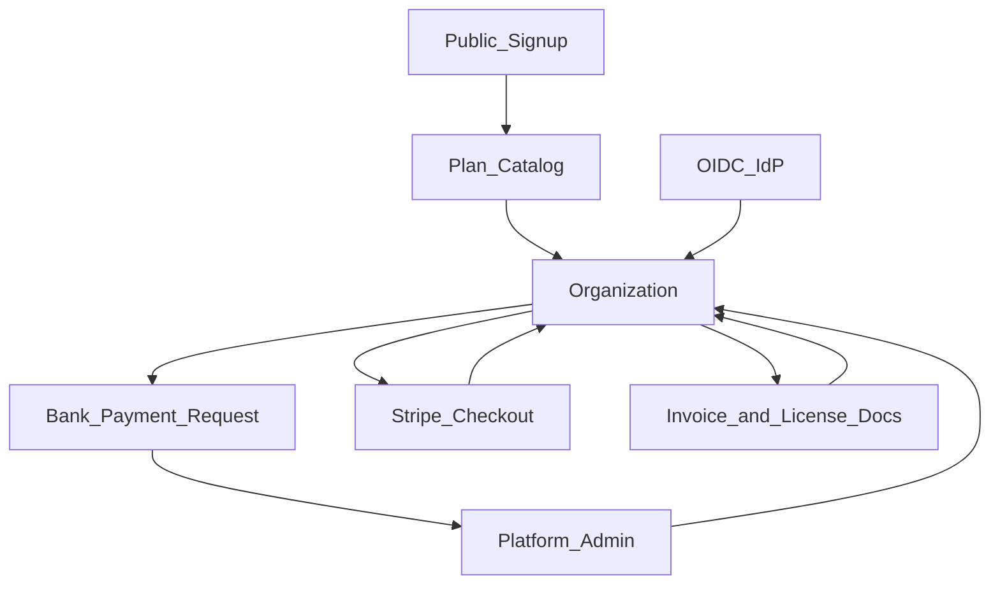

# Phase 2_F — Platform: Registration, Billing, SSO

**Версия:** 0.5  
**Дата:** 28 юли 2026 г.  
**Статус:** Active — Must 2–5 Done (plans + registration + bank + billing documents)  
**Родителски документи:**

- [CRA_Compliance_Workspace_Nachalen_Plan.md](CRA_Compliance_Workspace_Nachalen_Plan.md) (§14–§16; бизнес модел)
- [Phase2_E_Cross_Phase_Polish.md](Phase2_E_Cross_Phase_Polish.md) (Complete — сочи към F)
- [Internal_Manual_Test_Plan.md](Internal_Manual_Test_Plan.md) (Done / exited 2026-07-28)
- [Product_Compliance_Wizard.md](Product_Compliance_Wizard.md) (Done)

> **Цел на вълната:** go-to-market платформа — **публична регистрация / създаване на акаунт**, **планове + лимити**, **два начина на плащане** (банков превод + Stripe), **съхранение/доставка на фактури и лицензни документи**, **OIDC SSO** — без нова CRA domain вълна.

> **Kickoff решения (2026-07-28):** Billing **C** (с уточнение: и банково, и Stripe в същата вълна; фактуриране извън системата) + SSO **A** (OIDC в Must).

> **Ред на имплементация (предложен):** plan model + product limits → public signup / org bootstrap → billing status machine → bank payment + invoice/license docs → Stripe checkout/webhooks → SSO OIDC → admin ops + tests → Should (onboarding polish, annual UX) → Could.

> **Граница:** Phase 2.1–2.8 Closed; 2_E complete; Internal + Wizard Done. След F exit → окончателни тестове → deploy / клиенти. Optional **2.9** (scanner depth) остава извън F. Платени-only feature gates (освен product лимити) — **след** 2_F, не в Must.

---

## 1. Цел

Да може клиентът да:

- се **регистрира** и създаде организация (досега акаунти само от platform admin);
- избере план **Free / Small / Standard / Enterprise** с ясно product limit;
- плати с **банков превод** (фактура извън системата → upload/прилагане в системата → активиране при потвърдено плащане) или с **карта през Stripe**;
- получи **фактури и лицензни документи** в системата + канал за изпращане/доставка;
- (Enterprise / по policy) влезе с **OIDC SSO** (Entra ID / generic OIDC).

Platform admin запазва възможност да създава/коригира организации и планове ръчно (миграция от текущия admin Create/Edit flow).

---

## 2. Scope freeze (решения)

| Решение                 | Избор за Phase 2_F (frozen)                                                                                     | Алтернатива (Should/Could / по-късно)        |
| ----------------------- | --------------------------------------------------------------------------------------------------------------- | -------------------------------------------- |
| Kickoff billing         | **C** + уточнение: банково **и** Stripe в F                                                                     | Само admin / само Stripe                     |
| Kickoff SSO             | **A** — OIDC Must                                                                                               | SAML; SSO само за Enterprise Could polish    |
| Планове                 | **Free / Small / Standard / Enterprise** (не Solo/Small Team/Company от стар §15)                               | Seat limits (out of Must)                    |
| Product limits          | Free **1**; Small **3**; Standard **10**; Enterprise **неограничен**                                            | Soft warn vs hard block — **hard block** MVP |
| Функционалност          | Free = **пълна** друга функционалност; платени-only модули **след** 2_F                                         | Feature flags per plan (Could / post-F)      |
| Цени (EUR, provisional) | Small **29**/мес; Standard **39**/мес; Enterprise **59**/мес; Free **0**                                        | Промо кодове (Could)                         |
| Годишно                 | **~20%** отстъпка от 12× месечна (Small ≈ **278.40**; Standard ≈ **374.40**; Enterprise ≈ **566.40** EUR/год)   | Custom quote Enterprise (Could)              |
| Плащане 1               | **Банков превод** — заявка → фактура (външно) → upload/прилагане → admin/ops **активира** при плащане           | Автоматично bank matching (out)              |
| Плащане 2               | **Stripe** (Checkout / Subscriptions + webhooks)                                                                | PayPal / local PSPs (out)                    |
| Фактуриране             | **Извън системата** (счетоводство)                                                                              | Пълна e-invoicing engine (out)               |
| В системата             | Upload/прилагане + **хранилище** на издадени фактури; **канал за изпращане**; **лицензни документи** + доставка | Авто PDF generation на фактури (out)         |
| Регистрация             | Fortify/public **registration** + org create + plan select                                                      | Invite-only остава за users в org            |
| Admin path              | Запазва се: admin може да създава org + задава plan без checkout                                                | —                                            |
| SSO                     | **OIDC** (Entra / generic); целеви план **Enterprise** (включване за Standard = Should)                         | SAML 2.0 (Could / post-F)                    |
| Onboarding              | Лек post-signup checklist (org prep / етап 0 pointers)                                                          | Платена onboarding услуга (бизнес, извън UI) |

---

## 3. Планове (канон)

| Plan key     | Продукти (max) | Месечно (EUR) | Годишно (~20% off) |
| ------------ | -------------- | ------------- | ------------------ |
| `free`       | 1              | 0             | —                  |
| `small`      | 3              | 29            | 278.40             |
| `standard`   | 10             | 39            | 374.40             |
| `enterprise` | unlimited      | 59            | 566.40             |

`organizations.subscription_plan` (вече съществува) → enum/string на горните keys. Допълнителни полета (нови): billing interval, payment method, subscription status, Stripe ids, activated_at, и т.н. (виж §5).

---

## 4. Scope (in)

| Възможност                 | Описание                                                                 |
| -------------------------- | ------------------------------------------------------------------------ |
| Plan catalog + enforcement | Config/DB канон; hard limit при Product create                           |
| Public registration        | User + Organization bootstrap; избор на план                             |
| Billing status             | `pending_payment` / `active` / `past_due` / `cancelled` (или еквивалент) |
| Bank payment flow          | Заявка; инструкции; чакане; admin activate                               |
| Invoice documents          | Upload/attach издадени фактури; списък; изпращане към billing email      |
| License documents          | Генериране/upload + съхранение + доставка след purchase/activate         |
| Stripe                     | Checkout (month/year); customer portal или manage; webhooks              |
| SSO OIDC                   | Org IdP settings; login via OIDC; map към org users                      |
| Admin billing ops          | Преглед заявки; activate; override plan; upload docs от името на клиента |
| RBAC / audit               | Кой може да сменя plan, качва фактури, управлява SSO                     |
| i18n + tests               | BG+EN; feature tests със Stripe fake / OIDC fake                         |

---

## 5. Scope (out) — изрично

- Пълна счетоводна система / генериране на данъчни фактури в app (само store + deliver на външно издадени)
- Seat/user лимити по план (само products в Must)
- Платени-only feature gates извън product limit (отложено след 2_F)
- SAML SSO; SCIM provisioning
- Multi-currency; данъчни jurisdiction engines
- Marketplace / reseller portal
- Self-hosted лицензен ключ offline activation (отделна тема)
- Domain CRA модули / scanner 2.9

---

## 6. Архитектура (sketch)



### Предложени domain обекти (уточняват се в Must 1)

- `subscription_plan` + `billing_interval` (`month`|`year`) + `billing_status`
- `payment_method` (`bank`|`stripe`|`admin_comp`)
- Stripe: `stripe_customer_id`, `stripe_subscription_id`
- `organization_billing_documents` (type: `invoice`|`license`, file, sent_at, …)
- `organization_sso_connections` (issuer, client_id, secret encrypted, domains…)

Enforcement: при `ProductController@store` (и clone) — ако `products()->count() >= plan.max` → 422 / UI block.

---

## 7. Must / Should / Could

### Must

1. ~~Docs pointers (Nachalen §14/§15, 2_E → този файл) + freeze таблица~~
2. ~~Plan catalog + migrate `subscription_plan` към Free/Small/Standard/Enterprise + **product limit enforcement**~~
3. ~~Public registration + org create + plan select (Free active веднага; платени → pending до плащане/activate)~~
4. ~~Bank payment request flow + admin **activate on payment** (+ запазен admin create/override)~~
5. ~~Billing documents: upload/store **invoices** + **license docs**; send channel (email към `billing_email` / Owner)~~
6. Stripe Checkout (month/year) + webhooks → activate/renew/cancel status
7. OIDC SSO (Entra / generic) — org settings + login path (Enterprise Must; Standard optional flag OK)
8. i18n BG+EN + feature tests (limits, bank activate, Stripe fake, SSO fake)
9. Audit log за plan change / payment activate / doc send / SSO connect

### Should

10. Post-signup onboarding checklist (етап 0 pointers → users/settings/controls/policies)
11. Customer billing portal UI (текущ план, interval, docs, „смени плана“, Stripe manage)
12. Annual pricing UX ясно на signup/upgrade (20% messaging)
13. SSO за **Standard** (не само Enterprise)
14. Dunning / past_due UX (grace + read-only hint; без агресивно delete)

### Could

15. Promo codes / trial_ends_at wired към реален trial
16. Paid-only feature flags (първи конкретни разлики Free vs paid) — **предпочитано след F exit**
17. SAML 2.0
18. Auto-generate simple license PDF template
19. Seat limits / usage dashboard

---

## 8. Acceptance (high level)

| #   | Критерий                                                                                           |
| --- | -------------------------------------------------------------------------------------------------- |
| A1  | Free org: max 1 product; create на 2-ри → блокирано                                                |
| A2  | Small/Standard/Enterprise limits 3 / 10 / unlimited                                                |
| A3  | Signup създава user+org; Free usable без плащане                                                   |
| A4  | Bank path: pending → admin activate → plan active; invoice+license видими и send-able              |
| A5  | Stripe test mode: checkout → webhook → active; cancel/past_due отразени                            |
| A6  | OIDC login за свързана Enterprise org (happy path + reject unknown email domain policy documented) |
| A7  | Admin все още може да създаде org без self-serve                                                   |
| A8  | Няма секрети в audit; Stripe/OIDC secrets encrypted at rest                                        |

---

## 9. Зависимости и ред

```text
Internal + Wizard Done; 2_E complete
        ↓
Phase 2_F Must: plans/limits → signup → bank+docs → Stripe → SSO → tests
        ↓
Should / Could
        ↓
Phase 2_F exit → final tests → deploy / клиенти
```

---

## 10. История

| Версия | Дата       | Промяна                                                                                                                |
| ------ | ---------- | ---------------------------------------------------------------------------------------------------------------------- |
| 0.5    | 2026-07-28 | Must 5 Done — invoice/license docs store, download, email send (`billing_email`/Owner), admin+tenant UI, audit, tests  |
| 0.4    | 2026-07-28 | Must 4 Done — bank payment requests, Settings → Billing, admin activate-on-payment, audit, tests                       |
| 0.3    | 2026-07-28 | Must 3 Done — Fortify registration, org bootstrap, Free=active / paid=pending_payment, Register UI, tests              |
| 0.2.1  | 2026-07-28 | Schema cleanup: alter миграции обединени в create; legacy plan aliases/null→enterprise премахнати; default plan = free |
| 0.2    | 2026-07-28 | Must 2 Done — billing catalog, SubscriptionPlan, product quota enforcement, admin Select, tests                        |
| 0.1    | 2026-07-28 | Skeleton Active — kickoff C+A; tiers Free/Small/Standard/Enterprise; bank+Stripe; invoice/license docs; OIDC           |
